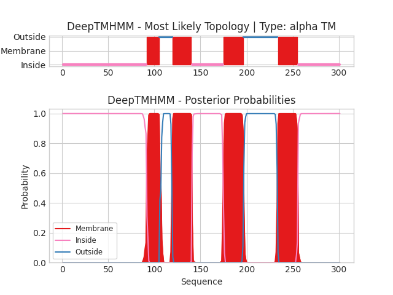
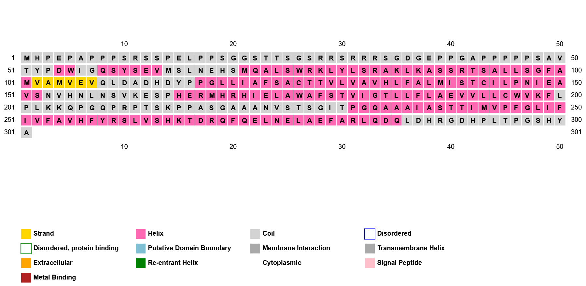
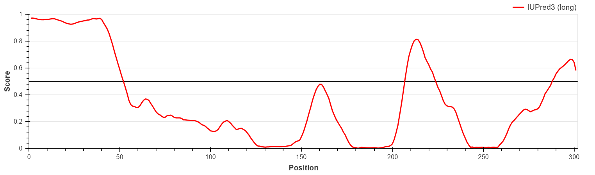
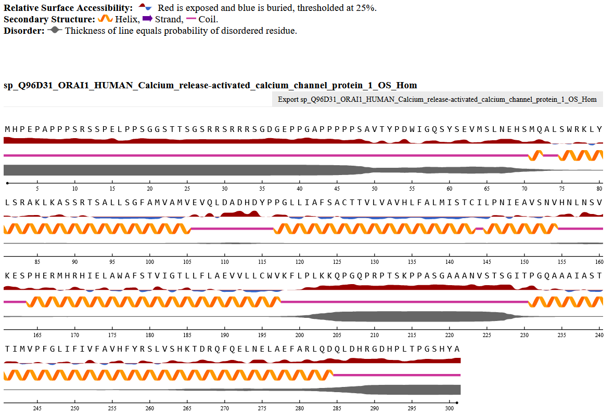

## Protein 1

## Comprobar bbl

The primary sequence of human ORAI1 (301 aa) exhibits the characteristic architecture of a store-operated calcium channel pore-forming subunit. The protein contains four predicted transmembrane helices (TM1–TM4) that span the membrane and assemble to form the central ion-conducting pore of the CRAC channel (Prakriya et al., 2006; Hou et al., 2012). Among these segments, TM1 lines the channel pore and contains the highly conserved Glu106 residue, which is essential for the strong Ca²⁺ selectivity of the channel (Prakriya et al., 2006). Both the N- and C-terminal regions are cytosolic and play key regulatory roles by interacting with the ER Ca²⁺ sensor STIM1, which activates ORAI1 under conditions of depletion of intracellular Ca²⁺ stores (Soboloff et al., 2012). In addition, specific residues in the cytoplasmic regions contribute to channel regulation, such as Cys195, whose oxidation has been shown to modulate channel activity and promote channel inactivation (Soboloff et al., 2012; UniProt Consortium, 2024).

## Transmembrane topology (DeepTMHMM)

In order to predict the transmembrane topology of ORAI1 the server of DeepTMHMM was used as is a well-known deep-learning based tool designed specifically to identify transmembrane helices with high accuracy from the aminoacid sequence. 

The analysis classified ORAI1 as a transmembrane protein containing four transmembrane helices, consistent with the topology described for CRAC chanel subunits. Specifically, the helices were located at residues 92-105, 120-140, 175-196 and 234-255. 
In adittion, both the N-terminal (residues 92-105) and the C-terminal (residues 256-301) regions, and the loop connecting TM2-TM3, are located in the cytoplasmic side, whereas the loops that links TM1-TM2 an TM3-TM4 are predicted to be located in the extracellular side.
This topology matches with the known organization of ORAI1 in the membrane and is related with its function as the pore of the CRAC channel (Prakriya et al., 2006; Hou et al., 2012).

The high posterior probabilities observed for all transmembrane segments (@fig-DeepTMHMM-ORAI1) indicate a good prediction, this means that this regions are likely to be prediced with higher confidence than the loops regions.

{#fig-DeepTMHMM-ORAI1}

## Secondary structure prediction (PSIPRED)

Secondary structure prediction of the ORAI1 protein was performed using PSIPRED in order to verify that the regions previously predicted as transmembrane segments correspond to α-helical structures, while the remaining parts of the sequence mainly adopt coil conformations (@fig-PSIPRED-ORAI1).

The analysis shows that the N-terminal portion of the protein is composed of coil structures, suggesting that it corresponds to a cytoplasmic segment. In contrast, the central part of the sequence contains four well-defined α-helical regions connected by short coil segments. These helices match with the transmembrane regions previously predicted by DeepTMHMM, whereas the coil regions correspond to extracellular and intracellular loops. This structural organization is consistent with the known architecture of ORAI family channels. 

Finally, the C-terminal region is also predicted to adopt mainly coil conformations, supporting its role as a flexible cytoplasmic domain involved in regulatory interactions.

{#fig-PSIPRED-ORAI1}

## Intrinsic disorder prediction (IUPred3)

To predict the propensity of each amino acid to be located in intrinsically disordered regions, IUPred3 was used. The results are shown in @fig-IUPred3-ORAI1.

The N-terminal region (residues 1–50) shows high disorder scores, indicating that it is a highly flexible segment. This is consistent with its cytosolic localization predicted by DeepTMHMM and the coil conformation predicted by PSIPRED.

In the central part of the protein, alternating intervals of structured regions (low disorder scores) and peaks of higher disorder are observed. This pattern is compatible with the presence of transmembrane domains linked by flexible loops.

Finally, the C-terminal region displays moderately high disorder scores (~0.5–0.6), suggesting partial flexibility. This is consistent with its proposed role as a regulatory cytoplasmic domain in Orai1.

{#fig-IUPred3-ORAI1}

## Solvent accessibility (NetSurfP)

Additional structural features were analysed using NetSurfP to evaluate solvent accessibility along the ORAI1 sequence (@fig-NetSurfP-ORAI1). The N-terminal region shows high relative surface accessibility (RSA), indicating that these residues are predominantly solvent-exposed, consistent with a cytoplasmic and flexible segment. In contrast, the residues located in the central region have low RSA values and are classified as buried, suggesting that they form the hydrophobic core of the transmembrane region.

These positions also display very high α-helix probabilities, confirming that the segments previously predicted as transmembrane helices correspond to stable α-helical structures. Between these helices, short regions with increased solvent accessibility are observed, which likely correspond to extracellular and intracellular loops connecting the transmembrane segments. Finally, the C-terminal region again shows higher accessibility and lower helix propensity, supporting its role as a cytoplasmic and flexible regulatory domain.

{#fig-NetSurfP-ORAI1}

**Conclusion (Se puede quitar)**
The combined 1D analysis reveals that ORAI1 contains four transmembrane α-helices supported by topology, secondary structure, and accessibility predictions, forming a structured membrane-embedded core. In contrast, the N- and C-terminal regions show higher disorder and solvent exposure, indicating flexible cytoplasmic domains. Overall, this organization is consistent with the typical architecture of ORAI calcium channels.