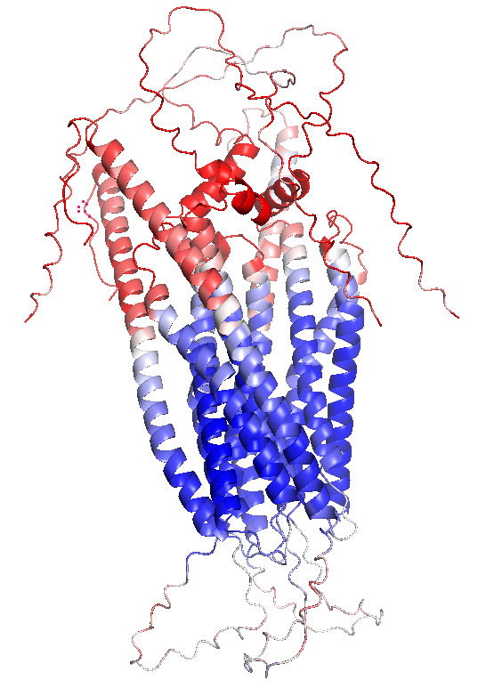
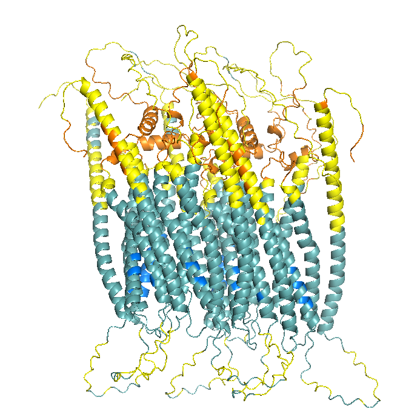

## Protein 1 - ORAI1

Sequence to model:
>sp|Q96D31|ORAI1_HUMAN Calcium release-activated calcium channel protein 1 OS=Homo sapiens OX=9606 GN=ORAI1 PE=1 SV=2
MHPEPAPPPSRSSPELPPSGGSTTSGSRRSRRRSGDGEPPGAPPPPPSAVTYPDWIGQSYSEVMSLNEHSMQALSWRKLYLSRAKLKASSRTSALLSGFAMVAMVEVQLDADHDYPPGLLIAFSACTTVLVAVHLFALMISTCILPNIEAVSNVHNLNSVKESPHERMHRHIELAWAFSTVIGTLLFLAEVVLLCWVKFLPLKKQPGQPRPTSKPPASGAAANVSTSGITPGQAAAIASTTIMVPFGLIFIVFAVHFYRSLVSHKTDRQFQELNELAEFARLQDQLDHRGDHPLTPGSHYA

Selected models:

### Deep Learning - AlphaFold3

#### Justification of the method

To model the oligomeric structure of ORAI1, we initially intended to use AlphaFold2 Multimer. However,due to the hardware limitations imposed by the computational requirements of AlphaFold2, we instead employed AlphaFold3, which allows for more efficient modeling of large multimeric assemblies. The main drawback of AF3 is its “black box” nature, which limits direct control over intermediate modeling steps. 
However, AF3 offers significant advantages, such as faster processing times, the ability to handle larger complexes, and improved refinement of inter-chain interactions, providing reliable structural insights even under restricted computational resources.

#### Methods

The sequence was entered into the [AlphaFold 3 server](https://alphafoldserver.com/) (`copies: 6`) to represent the hexameric assembly. 

Additionally, to visualize the predicted models, PyMOL was used to color the structures according to per-residue confidence scores (pLDDT) using the `spectrum b, red_white_blue, minimum=50, maximum=90` command.

#### Results

The predicted models and the results extracted from the output files are summarized in @tbl-orai1-af3.

| Parameter | Value | Description |
|-----------|-------|--------------------------|
| **Ranking Score** | 0.81 | Overall confidence score of the model |
| **ipTM** | 0.65 | Interface predicted TM-score |
| **pTM** | 0.66 | Predicted TM-score for the global topology |
| **Fraction Disordered** | 0.32 | Fraction of residues predicted as disordered |
| **Has Clash** | 0.0 | Number of steric clashes detected |
| **Recycles** | 10.0 | Number of internal refinement cycles used |

: Structural quality metrics obtained for the predicted ORAI1 hexameric model. {#tbl-orai1-af3}

<h1 style="color:red;">ESTO DE ABAJO SI LO VEIS TOO MUCH SE QUTIA (en teoria solo hay que hacer una estructura por proteína pero es q sino es todo analisis de los outputs de estadisticas ns)</h1>

The predicted model by AF3 with the highest quality is shown in @fig-orai1-AF3structure.

{#fig-orai1-AF3structure}

#### Interpretation of results (Discussion)

Regarding the results obtained (@tbl-orai1-af3), the ranking score of 0.81 indicates high confidence in the overall architecture of the hexamer. 
The ipTM value of 0.65 suggests that the interactions between the six chains are generally consistent, supporting the formation of a coherent central pore, although it is slightly below the ideal threshold for maximum interface confidence. In the same line, the pTM score of 0.66 reflects that the global folding of the hexameric channel is correctly predicted, indicating that the overall topology of the assembly is reliable. 
Approximately 32% of residues are predicted to be disordered, consistent with the intrinsically flexible cytoplasmic N- and C-terminal regions of human ORAI1. Also, no steric clashes were detected, confirming that the atomic geometry of the model is physically plausible. 
Nevertheless, the model used an increased number of recycling cycles (10 recycles), allowing additional refinement to improve inter-chain contacts and better adjust the hexameric assembly.

Concerning the structure shown in Figure @fig-orai1-AF3structure, dark blue regions (high-quality regions) correspond to the four transmembrane helices of each subunit, confirming the architecture of the channel pore. Cyan to white regions indicate good confidence in the connecting loops. Finally, the cytoplasmic N- and C-terminal tails are shown in red, reflecting high flexibility and structural uncertainty, consistent with their nature as intrinsically disordered regions. 
This observations are consistent with the statistical confidence metrics provided by AlphaFold for these regions.

### Homology based - SWISS-MODEL

#### Justification of the method

SWISS-MODEL was chosen as a second modeling approach to apply a classical homology-based methodology using high-resolution experimental templates. This platform allows the prediction to be anchored on known structures of orthologous proteins, which is essential to validate the overall architecture of the channel and the geometry of the pore. 
Additionally, SWISS-MODEL provides automated template selection, quality assessment scores, and model refinement, ensuring reliable and interpretable models. 
This approach is considered the gold standard when high-resolution experimental templates (Cryo-EM or X-ray crystallography) are available, like for ORAI1.

#### Methods

For [SWISS-MODEL](https://swissmodel.expasy.org/interactive), only the protein sequence was submitted once, as the server automatically handles oligomeric assemblies through the selected templates. During the “Search for Templates” step, high-resolution experimental structures were examined as potential references for homology modeling.

Templates with the highest sequence identity were prioritized, and the hexameric oligomeric state was selected in order to model the complete channel. The top hit was Q96D31.1.A, which corresponds to an existing AlphaFold model but it was not used because it represents a monomer.

Instead, an experimental template obtained by X-ray crystallography was selected (4HKS.1.A). It has a resolution of 3.4 Å, is a homo-hexamer, and includes calcium ions, making it ideal for comparison with the AlphaFold model to assess whether the channel pore and ion-binding sites are correctly preserved.

#### Results

The homology model generated using SWISS-MODEL (@fig-orai1-swissmodel) was based on the crystal structure of the Orai protein from Drosophila melanogaster (PDB ID: 4HKS), which shares 62.43% sequence identity with the human protein.

The results of the model, including the quality metrics, are summarized in @tbl-orai1-swissmodel.

{#fig-orai1-swissmodel}

| Parameter | Value | Description |
|-----------|-------|-------------|
| **Template** | 4HKS.1.A | X-ray crystallography structure of *Drosophila* (3.35 Å) |
| **Oligomeric State** | Homo-hexamer | Biologically functional assembly of the channel |
| **Sequence Identity** | 62.43% | Sequence identity with human ORAI1 |
| **GMQE** | 0.37 | Global Model Quality Estimation |
| **QMEANDisCo Global** | 0.59 ± 0.05 | QMEANDisCo score for overall structural quality |

: Key parameters of the homology model generated with SWISS-MODEL. {#tbl-orai1-swissmodel}

Additionally, the QMEANDisCo Local Score can also be analyzed (@fig-orai1-qmeandisco-local) to assess the per-residue confidence across the ORAI1 structure.

{#fig-orai1-qmeandisco-local}

#### Interpretation of results (Discussion)

Although the GMQE (0.37) and QMEANDisCo (0.59) scores may appear moderate, as seen in @tbl-orai1-swissmodel, they accurately reflect the structural characteristics of human ORAI1. The selected template primarily covers the transmembrane domains, leaving out the N- and C-terminal regions. The high sequence identity in the channel core (62.43%) ensures that the pore architecture is accurately modeled, while the lower global scores are a common artifact in membrane proteins with long cytoplasmic segments lacking defined secondary structure.
<h1 style="color:red;">@@@este parrafo de arrriba ns si me gsut no se no se </h1>

Additionaly, focusing on the per-residue confidence (@fig-orai1-qmeandisco-local), four distinct peaks of high confidence (values between 0.6 and 0.8) are clearly visible. These peaks correspond to the four transmembrane helices described previously.

In contrast, the pronounced drops in confidence coincide with extracellular and intracellular loop regions (N- and C-terminal regions), which are typically more flexible and therefore more difficult to model accurately.

Overall, this pattern confirms that the structural core of the protein is predicted with relatively high reliability, whereas the flexible terminal and loop regions reduce the global quality score.

It is also shown in the modeled structure (@fig-orai1-swissmodel).

### Protein language based model - ESMFold

#### Justification of the method

ESMFold predicts the three-dimensional structure of proteins directly from their amino acid sequence using a protein language model (pLM). Unlike many other structure prediction methods, it relies on internal representations generated by a transformer-based architecture to infer interatomic distances and torsion angles, without requiring a search for evolutionary sequence alignments (MSA). As a result, the computational cost is significantly reduced.

This approach can be particularly advantageous for proteins such as ORAI1, whose flexible terminal regions and membrane-associated segments may be difficult to model using traditional homology-based methods, as language-model-based predictions can better capture structural patterns directly from sequence information.

<h1 style="color:red;"> en este parrafo de arriba decimos que va a mejorar en teoría el modelado del nter y cter, si no es así, lo pondría en la discusion de este metodo - pa tener en cuenta sinmas </h1>

#### Methods

Due to the memory limitations (900 residue limit), a reduced oligomeric model was generated in [ESMFold](https://colab.research.google.com/github/sokrypton/ColabFold/blob/main/ESMFold.ipynb#scrollTo=CcyNpAvhTX6q). The sequence was analysed using three copies (`copies: 3`) and three recycling cycles (`num_recycles: 3`), which improves the refinement of inter-chain contacts while keeping the computational cost manageable.

To visualize the predicted models, the hexameric assembly was manually reconstructed by duplicating the predicted trimer and positioning it to form the full complex.

#### Results

First, ESMFold provides a confidence plot (@fig-confidenceplot-ESMFold) composed of three complementary panels that allow evaluation of both the structural reliability and the predicted inter-chain interactions.

{#fig-confidenceplot-ESMFold}

<h1 style="color:red;">ESTO DE ABAJO tmb se puede quitar como arriba</h1>

The predicted model by ESMFold is shown in @fig-orai1-ESMfold-structure.

::: {#fig-orai1-ESMfold-structure layout-ncol=2}

{#fig-panel-a-ESMstructure}

{#fig-panel-b-ESMstructure}

ESMFold structural predictions for ORAI1.
:::

#### Interpretation of results (Discussion)

First, in the confidence plot (@fig-confidenceplot-ESMFold) is shown that the pLDDT profile has three similar patterns, corresponding to the three copies of the sequence. Each pattern displays four prominent peaks of high confidence, which correspond to the four transmembrane helices of each ORAI1 subunit. 

Second, the Predicted Aligned Error (PAE) matrix shows a clear diagonal, reflecting high confidence in the internal structure. In addition, off-diagonal blocks reveal stable contacts between helices belonging to different subunits.

Finally, the contact map further supports these interactions by highlighting recurrent contacts between the transmembrane helices, again suggesting a stable packing of the helices within the trimeric assembly.

In adittion, the manual reconstruction of the hexamer from two independent ESMFold trimers (@fig-panel-b-ESMstructure) supports the structural stability of the complex. The transmembrane helices align well between subunits, forming a symmetric central pore characteristic of the ORAI1 channel.

<h1 style="color=red;"> igual el parrafo de justo encima un poco pedante? nos e si supportea eso o no idkkkkkk- las copie y las pegué según me quedaban bien sjdfjasdjfasj</h1> 

This suggests that, despite the sequence length limitations of the ESMFold server, the structural information captured by the language model is sufficient to predict the key interfaces required for assembly of the functional channel.