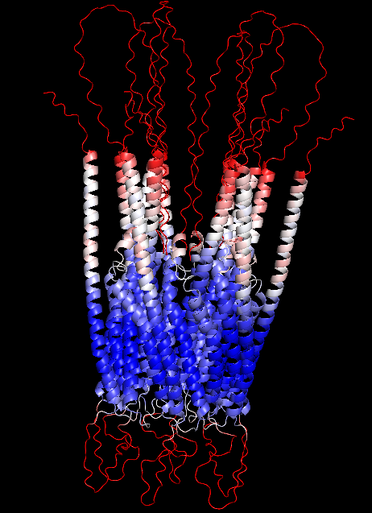
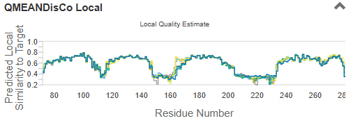
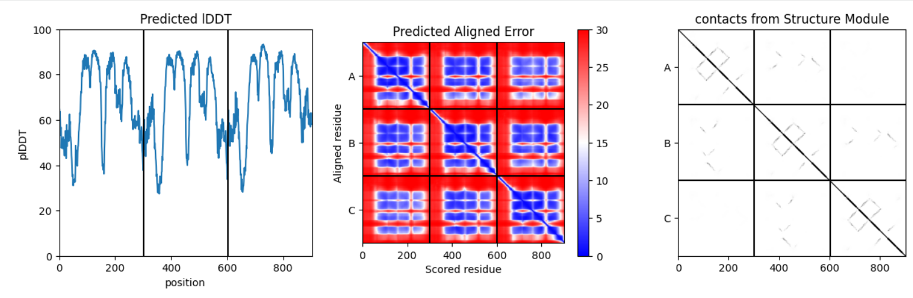

## Protein 1 - ORAI1

Sequence to model:
>sp|Q96D31|ORAI1_HUMAN Calcium release-activated calcium channel protein 1 OS=Homo sapiens OX=9606 GN=ORAI1 PE=1 SV=2
MHPEPAPPPSRSSPELPPSGGSTTSGSRRSRRRSGDGEPPGAPPPPPSAVTYPDWIGQSYSEVMSLNEHSMQALSWRKLYLSRAKLKASSRTSALLSGFAMVAMVEVQLDADHDYPPGLLIAFSACTTVLVAVHLFALMISTCILPNIEAVSNVHNLNSVKESPHERMHRHIELAWAFSTVIGTLLFLAEVVLLCWVKFLPLKKQPGQPRPTSKPPASGAAANVSTSGITPGQAAAIASTTIMVPFGLIFIVFAVHFYRSLVSHKTDRQFQELNELAEFARLQDQLDHRGDHPLTPGSHYA

Selected models:

### Deep Learning (AlphaFold2-Multimer + AlphaFold3) 

https://colab.research.google.com/github/sokrypton/ColabFold/blob/main/AlphaFold2.ipynb#scrollTo=ADDuaolKmjGW - AF2

https://alphafoldserver.com/ - AF3

#### Justification of the method

To model the oligomeric structure of ORAI1, we used AlphaFold2 Multimer implemented through *ColabFold*. 
AlphaFold2 Multimer is specifically designed to predict protein–protein interactions and multimeric assemblies, making it suitable for modeling the hexameric arrangement of ORAI1 subunits. 
ColabFold provides an efficient and accessible implementation of AlphaFold2 Multimer with optimized multiple sequence alignment generation and accelerated inference, allowing reliable prediction of protein complexes with reduced computational cost. 
Therefore, this approach enables the structural modeling of the ORAI1 hexamer and the analysis of the interactions that stabilize the channel pore.
However, the resulting model represents a static structural snapshot of the predicted complex rather than the full conformational dynamics of the channel.

Despite the hardware limitations imposed by the computational requirements of AlphaFold2 , we also employed AlphaFold3, which allows for more efficient modeling of large multimeric assemblies. The main drawback of AF3 is its “black box” nature, which limits direct control over intermediate modeling steps. 
However, AF3 offers significant advantages, such as faster processing times, the ability to handle larger complexes, and improved refinement of inter-chain interactions, providing reliable structural insights even under restricted computational resources.

#### Methods

For AlphaFold2-Multimer:
For predicting the hexameric ORAI1 channel, the alpha isoform sequence was repeated six times. AlphaFold2 Multimer v3 was used with templates from the PDB (`template_mode: pdb100`) and evolutionary information from `msa_mode: mmseqs2_uniref_env`. Parameters were optimized for homo-oligomeric complexes, including `pair_mode: unpaired_paired`, `num_recycles: 3` to refine the structure internally, `recycle_early_stop_tolerance: 0.5` to allow early termination when improvements become minimal, `num_relax: 1`, and `relax_max_iteration: 200` for final structural relaxation. 
Sequence pairing used a greedy strategy, MSA size was set to automatic (`max_msa: auto`), and a single model (`num_seeds: 1`) was generated-

For AlphaFold3:
The sequence was entered (`copies: 6`) to represent the hexameric assembly. 

Additionally, to visualize the predicted models, PyMOL was used to color the structures according to per-residue confidence scores (pLDDT) using the `spectrum b, red_white_blue, minimum=50, maximum=90` command.

#### Results

Using AlphaFold2-Multimer, a Sequence Coverage Plot is obtained to help evaluate the expected reliability of the model (@fig-orai1-AFSeqCoverage).

{#fig-orai1-AFSeqCoverage}

<!-- ################################ SPACE FOR AF2-Multimer RESULTS ################################ -->

For AlphaFold3, the predicted models and the results extracted from the output files are summarized in @tbl-orai1-af3.

| Parameter | Value | Description |
|-----------|-------|--------------------------|
| **Ranking Score** | 0.81 | Overall confidence score of the model |
| **ipTM** | 0.65 | Interface predicted TM-score |
| **pTM** | 0.66 | Predicted TM-score for the global topology |
| **Fraction Disordered** | 0.32 | Fraction of residues predicted as disordered |
| **Has Clash** | 0.0 | Number of steric clashes detected |
| **Recycles** | 10.0 | Number of internal refinement cycles used |

: Structural quality metrics obtained for the predicted ORAI1 hexameric model. {#tbl-orai1-af3}

The predicted model by AF3 with the highest quality is shown in @fig-orai1-AF3structure.

{#fig-orai1-AF3structure}

#### Interpretation of results (Discussion)

The black line in the Sequence Coverage Plot (Figure @fig-orai1-AFSeqCoverage) represents the number of sequences aligned at each residue position. This shows that the transmembrane domains of ORAI1 are highly conserved, whereas the N-terminal and C-terminal regions display lower coverage, consistent with their intrinsic flexibility. Overall, the plot indicates deep evolutionary coverage in the protein core, suggesting that AlphaFold2 Multimer has sufficient information to accurately predict the folding.

<!-- ################################ SPACE FOR AF2-Multimer DISCUSSION ################################ -->

Regarding the results obtained from AF3 (@tbl-orai1-af3), the ranking score of 0.81 indicates high confidence in the overall architecture of the hexamer. 
The ipTM value of 0.65 suggests that the interactions between the six chains are generally consistent, supporting the formation of a coherent central pore, although it is slightly below the ideal threshold for maximum interface confidence. In the same line, the pTM score of 0.66 reflects that the global folding of the hexameric channel is correctly predicted, indicating that the overall topology of the assembly is reliable. 
Approximately 32% of residues are predicted to be disordered, consistent with the intrinsically flexible cytoplasmic N- and C-terminal regions of human ORAI1. Also, no steric clashes were detected, confirming that the atomic geometry of the model is physically plausible. 
Nevertheless, the model used an increased number of recycling cycles (Recycles = 10), allowing additional refinement to improve inter-chain contacts and better adjust the hexameric assembly.

Concerning the structure shown in Figure @fig-orai1-AF3structure, dark blue regions (high-quality regions) correspond to the four transmembrane helices (TM1–TM4) of each subunit, confirming the architecture of the channel pore. Cyan to white regions indicate good confidence in the connecting loops. Finally, the cytoplasmic N- and C-terminal tails are shown in red to orange, reflecting high flexibility and structural uncertainty, consistent with their nature as intrinsically disordered regions.

### SWISS-MODEL (Homology based)

https://swissmodel.expasy.org/interactive

#### Justification of the method

SWISS-MODEL was chosen as a second modeling approach to apply a classical homology-based methodology using high-resolution experimental templates. This platform allows the prediction to be anchored on known structures of orthologous proteins, which is essential to validate the overall architecture of the channel and the geometry of the pore. 
Additionally, SWISS-MODEL provides automated template selection, quality assessment scores, and model refinement, ensuring reliable and interpretable models. 
Also, this approach is considered the gold standard when high-resolution experimental templates (Cryo-EM or X-ray crystallography) are available (like for ORAI1).

#### Methods

For SWISS-MODEL, only the protein sequence was submitted once, since the server automatically handles oligomeric assemblies through the selected templates. In the “Search for Templates” step, we looked for high-resolution experimental structures to serve as references for homology modeling.

Once the results appeared, we focused on templates with the highest sequence identity and selected the hexameric oligomeric state to model the complete channel. Among the available templates, the top hit was Q96D31.1.A, which corresponds to an existing AlphaFold model. We did not use this entry because it represents a monomer rather than the full hexameric channel.

Instead, we chose a true experimental template obtained by X-ray crystallography. We selected 4HKS.1.B, which has a resolution of 3.4 Å, is a homo-hexamer, and includes calcium ions, making it ideal for comparison with the AlphaFold model to assess whether the channel pore and ion-binding sites are correctly preserved.
Template used to build models:
>>4hks.1.A Calcium release-activated calcium channel protein 1
>>Calcium release-activated calcium (CRAC) channel ORAI

#### Results

The homology model generated using SWISS-MODEL (@fig-orai1-swissmodel) was based on the crystal structure of the Orai protein from Drosophila melanogaster (PDB ID: 4HKS), which shares 62.43% sequence identity with the human protein.
The results of the model, including the quality metrics, are summarized in @tbl-orai1-swissmodel.

{#fig-orai1-swissmodel}

| Parameter | Value | Description |
|-----------|-------|-------------|
| **Template** | 4HKS.1.A | X-ray crystallography structure of *Drosophila* (3.35 Å) |
| **Oligomeric State** | Homo-hexamer | Biologically functional assembly of the channel |
| **Sequence Identity** | 62.43% | Sequence identity with human ORAI1 |
| **GMQE** | 0.37 | Global Model Quality Estimation |
| **QMEANDisCo Global** | 0.59 ± 0.05 | QMEANDisCo score for overall structural quality |

: Key parameters of the homology model generated with SWISS-MODEL. {#tbl-orai1-swissmodel}

Additionally, the QMEANDisCo Local Score can also be analyzed (@fig-orai1-qmeandisco-local) to assess the per-residue confidence across the ORAI1 structure.

{#fig-orai1-qmeandisco-local}

#### Interpretation of results (Discussion)

Although the GMQE (0.37) and QMEANDisCo (0.59) scores may appear moderate, as seen in @tbl-orai1-swissmodel, they accurately reflect the structural characteristics of human ORAI1. The selected template (4HKS.1.A) primarily covers the transmembrane domains, leaving out the N- and C-terminal regions, which are intrinsically disordered in humans. The high sequence identity in the channel core (62.43%) ensures that the pore architecture is accurately modeled, while the lower global scores are a common artifact in membrane proteins with long cytoplasmic segments lacking defined secondary structure.

Additionaly, focusing on the per-residue confidence (@fig-orai1-qmeandisco-local), four distinct peaks of high confidence (values between 0.6 and 0.8) are clearly visible. These peaks correspond to the four transmembrane helices (TM1–TM4) described previously.
In contrast, the pronounced drops in confidence coincide with extracellular and intracellular loop regions(N- and C-terminal regions), which are typically more flexible and therefore more difficult to model accurately.
Overall, this pattern confirms that the structural core of the channel—formed by the transmembrane helices—is predicted with relatively high reliability, whereas the flexible terminal and loop regions reduce the global quality score.
It is also shown in the modeled structure, @fig-orai1-swissmodel.

### ESMFold

https://colab.research.google.com/github/sokrypton/ColabFold/blob/main/ESMFold.ipynb#scrollTo=CcyNpAvhTX6q

#### Justification of the method

ESMFold predicts the three-dimensional structure of proteins directly from their amino acid sequence using a protein language model (pLM). Unlike many other structure prediction methods, it relies on internal representations generated by a transformer-based architecture to infer interatomic distances and torsion angles, without requiring a search for evolutionary sequence alignments (MSA). As a result, the computational cost is significantly reduced.

This approach can be particularly advantageous for proteins such as ORAI1, whose flexible terminal regions and membrane-associated segments may be difficult to model using traditional homology-based methods, as language-model-based predictions can better capture structural patterns directly from sequence information.

#### Methods

Due to the memory limitations (900 residue limit), a reduced oligomeric model was generated in ESMFold (trimer). Instead of modelling the full complex, a smaller multimeric assembly was used to explore whether the predicted structure could correctly reproduce the protein–protein interface and the relative orientation of the transmembrane helices. This serves as an intermediate structural validation between the monomeric model and the functional hexameric assembly obtained with the other methods.

For this reason, the sequence was analysed using three copies (`copies: 3`) and three recycling cycles (`num_recycles: 3`), which improves the refinement of inter-chain contacts while keeping the computational cost manageable.

#### Results

En primer lugar, ESM fold te 
@@@confidence plot que te da ESMFold:
(trimero)

@@modelo ya subido!
@@@@analizar modelo

#### Interpretation of results (Discussion)