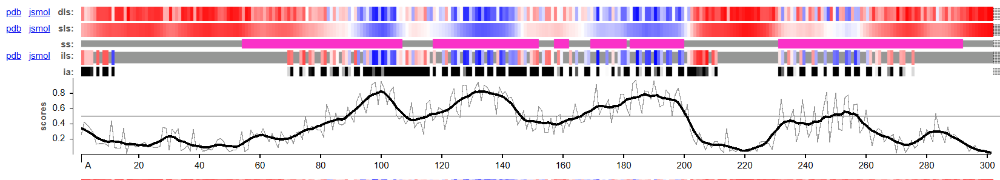
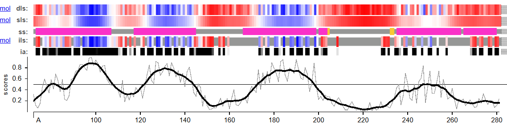
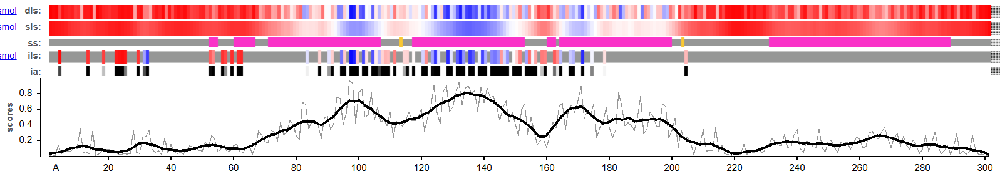
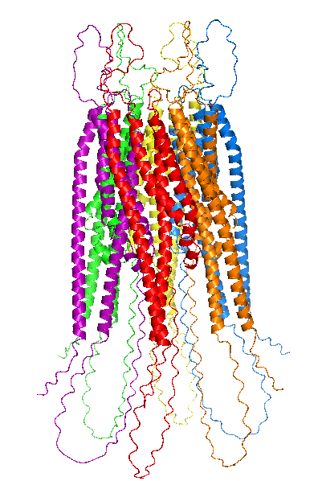
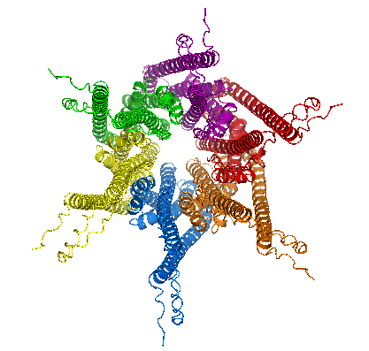
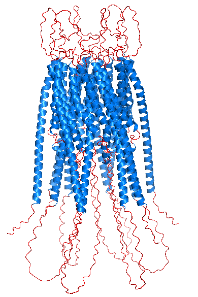
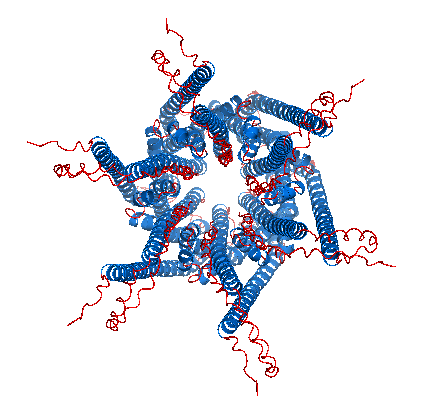

# Evaluation of models between methods of protein 1

# Methods

@@lucia escribe los métodos que hayas usado para comparar los modelos (ponlo a nivel general para que sirva para todas ls proteínas y ya en el resto se diga q se haga como en la uno)

Additionally, VoroMQA [VoroMQA](https://bioinformatics.lt/wtsam/voromqa)(Voronoi Tessellation-based Model Quality Assessment) was employed for third-level structural validation. Unlike tools such as AlphaFold or Swiss-Model, which assess the confidence of their own predictions, VoroMQA evaluates structural quality based purely on geometric criteria, using Voronoi tessellation to assess atomic packing and detect potential structural inconsistencies.

For this analysis, `Input biological assemblies` was selected to evaluate the complete oligomeric state of the protein, rather than individual chains, ensuring a comprehensive assessment of the quaternary structure.
The `Enable evaluation of inter-chain interfaces` was enabled to specifically assess the quality of interactions at the subunit interfaces.

# Evaluation

@@@evaluaciondelucia

The results of the VoroMQA evaluation are summarized in the @tbl-model-comparison-ORAI1.

| Model | Global score | Interface i_score | i_energy |
|------|-------------|------------------|---------|
| Swiss-Model | 0.467 | 0.589 | -10441.9 |
| AlphaFold 3 | 0.432 | 0.584 | -10669.8 |
| ESMFold | 0.361 | 0.544 | -3540.4 |

: Comparison of the structural quality and interface scores obtained for the models generated with Swiss-Model, AlphaFold3, and ESMFold for ORAI1. {#tbl-model-comparison-ORAI1}

Although the compared models correspond to different oligomeric states (hexamer in AF3/Swiss-Model vs. trimer in ESMFold), the VoroMQA analysis allows normalization of the atomic packing quality. 
The model generated by Swiss-Model, as is shown in the @tbl-model-comparison-ORAI1, had the highest global score (0.467), which is consistent with its template-based origin from experimentally determined structures.
However, the AlphaFold 3 model displayed the most favorable interface energy (-10669.8), suggesting that the AI-based approach optimized the contacts between the transmembrane helices more effectively than classical homology modeling.
The ESMFold model, which represents a smaller multimeric unit (trimer), showed lower energy values overall; nevertheless, it maintained a competitive interface score (i_score = 0.544), supporting the stability of the inter-chain interface even in the absence of the complete hexameric assembly.

In addition, the Local Score profiles (upper panels in @fig-voromqa-panels) show that the highest-confidence regions (shown in blue) occur at the same positions in all three models. Although the fourth transmembrane helix is slightly less well defined in the ESMFold model, the same trend can still be observed in the score distributions shown in the lower panels. This indicates that the transmembrane helices are correctly packed in all cases, which is consistent with the strong structural conservation of the channel.

::: {#fig-voromqa-panels layout-ncol=1}

{#a}

{#b}

{#c}

VoroMQA structural quality assessment for the three predicted models (AlphaFold3, Swiss-Model and ESMFold)
:::

Based on this analysis, the Swiss-Model structure achieves the highest global score. However, this is likely because the method trims flexible regions so that they appear more structured, or leaves them in simplified conformations. 

In contrast, AlphaFold3 reflects the biologically realistic situation more accurately: clearly shows that the N- and C-terminal tails are flexible. VoroMQA penalizes this because these regions appear less densely packed, but in the cellular context these flexible tails are expected to remain disordered in order to interact with other proteins.
Moreover, the binding energy of the AF3 model is more favorable, suggesting that AlphaFold3 has identified a hexameric arrangement of the transmembrane helices that is energetically more stable than the older crystal-based model.

For all these reasons, the final model selected for further analysis was the one generated by AlphaFold3, shown in @fig-orai1-final. In it, the formation of the central pore can be clearly observed, along with the correct packing of the transmembrane helices and the expected arrangement of the cytoplasmic N- and C-terminal regions. This structural organization is consistent with the functional architecture of ORAI1.

::: {#fig-orai1-final layout="[[1,1], [1,1]]"}

{#fig-a}

{#fig-b}

{#fig-c}

{#fig-d}

Final AlphaFold3 model of the ORAI1 hexameric channel. (a) Side view of the structure colored by chains, showing the six subunits that form the channel. (b) Top (pore) view colored by chains, highlighting the symmetric arrangement of the hexamer. (c) Side view colored by secondary structure, where α-helices are shown in navy blue, β-sheets in green, and loops or disordered regions in red. (d) Top (pore) view colored by secondary structure. 
:::

