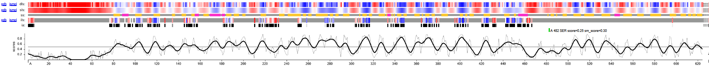
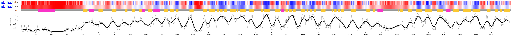
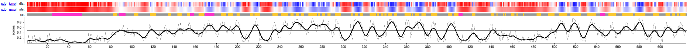
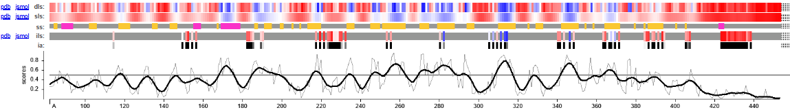

### Cross-method evaluation of Protein 2 models

#### **Methods**

To perform an additional level of structural validation, all generated models were evaluated using the VoroMQA method. The analysis was done following the same configuration applied to Protein 1.

#### **Final model selection**

@@@evaluaciondelucia

The results of the VoroMQA evaluation are summarized in the @tbl-model-comparison-protein2.

| Model | Global score | Interface i_score | i_energy |
|------|-------------|------------------|---------|
| AlphaFold 3 | 0.524 | 0.579 | -4028.0 |
| AlphaFold 2 | 0.496 | - | - |
| ESMFold | 0.477 | - | - |
| Swiss-Model | 0.410 | 0.304 | -1182.8 |

: Comparison of the structural quality and interface scores obtained for the models generated with AlphaFold3, AlphaFold2, ESMFold and Swiss-Model for Protein 2. {#tbl-model-comparison-protein2}

The evaluated models differ in their oligomeric state, (trimer in AF3/Swiss-Model vs. monomer in AF2/ESMFold). However, VoroMQA analysis allows a normalized assessment of atomic packing quality, allowing comparison across models despite their oligomeric state. 
For this reason, the monomeric models do not have interface-related scores (`i_score` and `i_energy`), as they do not have inter-chain interactions.

The AlphaFold 3 model had the highest global score, as is shown in @tbl-model-comparison-protein2. Its score is notably higher than those obtained for the monomeric models, suggesting that the protein has a more favorable atomic packing when it oligomerizes. 
This observation supports the hypothesis that oligomerization is required to achieve the thermodynamically stable native conformation.

In addition, the Local Score profiles (upper panels in @fig-voromqa-panels-protein2) show a highly consistent structural pattern across all models, where the high-confidence (blue) and low-confidence (red) regions occur at the same positions in the first three models, except for Swiss-Model.
Notably, the AlphaFold 3 model exhibits a smoother and higher profile, suggesting that oligomerization stabilizes flexible regions. In contrast, the Swiss-Model profile displays increased noise and local disruptions, reflecting the limitations of template-based modeling under low sequence identity conditions.

::: {#fig-voromqa-panels-protein2 layout-ncol=1}

{#a}

{#a}

{#c}

{#b}

VoroMQA structural quality assessment for the three predicted models (AlphaFold3, AlphaFold2, ESMFold and Swiss-Model)
:::

Focusing on the trimeric models, AlphaFold 3 model has a higher score in both interface-related metrics.
The interface score of the AlphaFold 3 model is notably higher than the Swiss-Model one, supporting a more realistic and a better interaction surface between subunits.

In addition, the interface energy is significantly more favorable in the AlphaFold 3 model compared to Swiss-Model. The large difference indicates that the interactions predicted by the first server are not only higher but also energetically more stable.

The poorest performance of Swiss-Model compared with the other models can be explained to the limitations of the template-based modeling, which is notable under low sequence identity conditions, as in this particular case. The lack of strong templates in disordered or flexible regions, forces Swiss-Model to eliminate these regions. As a result of the structural restrictions from the template, the interface geometry and the interaction stability are worse.

For all these reasons, AlphaFold 3 generated the most reliable model, both globally and at interface level, giving evidence that the trimeric assembly is the more stable state for Protein 2.