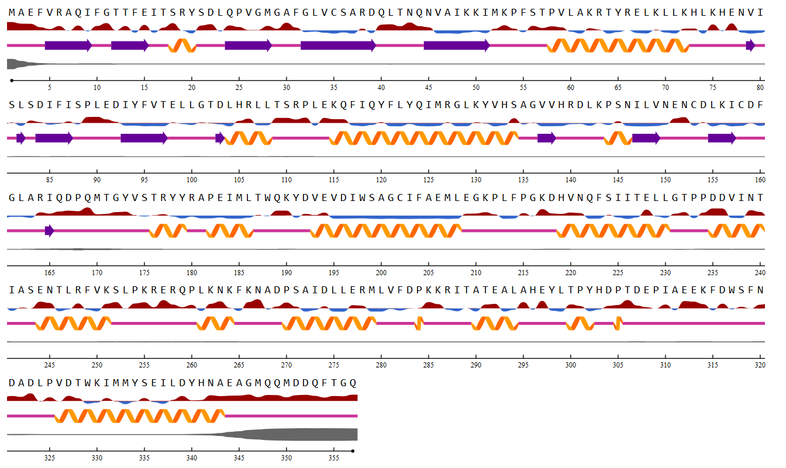

## Protein 3

The primary sequence of MoHog1/MoOsm1 (357 aa) exhibits the classic architecture of a MAP kinase. The catalytic domain (residues 23-311) contains all the conserved motifs necessary for phosphotransferase activity. Notably, the activation loop features the TGY motif (T171/Y173), characteristic of the stress-activated protein kinase (SAPK) family (@dixon1999, @liu2020). The activation of this motif through dual phosphorylation has been experimentally validated under osmotic and oxidative stress conditions, as well as in response to fungicide exposure (@motoyama2008). 

Building upon previous structural studies of p38 MAPKs, which demonstrated the formation of dimers through the swapping of activation segments (@rothweiler2011), the oligomeric state of MoOsm1 was experimentally evaluated. Functional assays confirmed that MoHog1/MoOsm1 exists in both monomeric and dimeric forms. However, the ability to dimerize is strictly regulated by the phosphorylation state of the activation loop. Specific point mutations which mimic different phosphorylation states shows that phosphorilation on Tyr173 serves as a molecular switch that inhibits the dimerization, the simulated phosphorilation on T171 does not shown any effect on dimerization. These findings imply that *in silico* phosphorylation on Tyr173 of the MoHog1/MoOsm1 dimer would likely result in steric clashes or significant conformational instability. Since the phosphorylated state (simulated by the Y173D mutation) prevents dimerization *in vivo*, any structural model attempting to force a phosphorylated activation loop into a dimeric interface would likely exhibit an energetically unfavorable or distorted geometry (@liu2020, @zhang2024). 

The structural features of MoOsm1/MoHog1 were evaluated using the NetSurfP-3.0 algorithm (@fig-NetSurfP-MoOsm1). The secondary structure prediction revealed a distinct modular organization: the N-terminal half of the sequence is characterized by a high density of $\beta$-sheets (interrupted by a single $\alpha$-helix), whereas the C-terminal half exhibits a predominant representation of $\alpha$-helices, interspersed with unstructured regions categorized as coils. Notably, the predicted disordered probability remains low throughout the core of the protein (as indicated by the grey line), with significant disordered regions appearing only at the flexible N- and C-terminal extremities.
Regarding the Relative Solvent Accessibility (RSA), the model shows a higher proportion of exposed residues compared to buried ones. This distribution was analyzed using a standard color-coded metric: red indicates exposed residues and blue indicates buried residues, thresholded at 25% RSA. A critical focus was placed on the activation loop containing the TGY phosphorylation motif (residues 171-173). The analysis confirms that these specific positions are highly solvent-exposed, falling well above the 25% threshold (red). This structural configuration is functionally essential, as it ensures that the TGY site is physically accessible to upstream MAPKKs and phosphatases, thereby facilitating the rapid phosphotransferase signaling mechanism required for the fungal stress response.

{#fig-NetSurfP-MoOsm1}