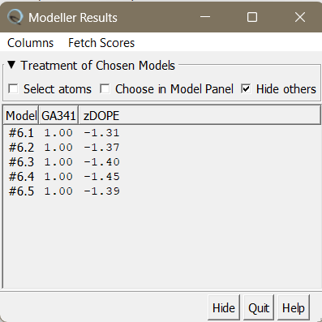

## Protein 3

-- FIX ME HASTA
Previous analysis:
ProtSA
Solvent radius ($\text{\AA}$)Parámetro: 1.4Por qué: Es el radio estándar de una molécula de agua. Se utiliza para simular una esfera que "rueda" sobre la superficie de la proteína; el área que esta esfera puede tocar es el Área de Superficie Accesible (SASA). Si usaras un valor distinto, tus resultados no serían comparables con el umbral del 16% de PROFacc.

Unfolded conformations to generate
Parámetro: 2000

Por qué: ProtSA calcula la accesibilidad relativa comparando tu modelo (estado plegado) con un estado teóricamente desplegado. Para que ese estado desplegado sea estadísticamente fiable, necesita generar miles de conformaciones al azar (Monte Carlo). 2000 es el número sugerido para que el cálculo sea robusto sin que el servidor tarde horas. No me llega el correo de que hestá hecho :/
-- AQUI-- Cuando salgan los resultados de ProtSA

Selected models:

To capture the dual nature of MoHog1—which alternates between a monomeric inactive state and a dimeric active state regulated by Y173 phosphorylation—a multi-platform approach was employed. AlphaFold 3 was selected for its superior accuracy in predicting the activation loop's local environment, while Modeller allowed for template-driven constraints to explore the monomeric interface based on experimental homologs.

I-TASSER was selected due to its hybrid methodology, which combines threading and ab initio modeling. While MoHog1/MoOsm1 has several homologs that have been experimentally resolved, the sequence identities generally hover around 40%. Although this level of identity is acceptable for generating reliable models via classical homology modeling, we decided to employ a threading-based approach to gain an independent structural perspective. By integrating fragment-based ab initio folding, I-TASSER can better resolve regions where evolutionary divergence might lead to local structural variations that traditional homology modeling might overlook. Furthermore, I-TASSER was also employed to determine solvent accessibility (ASA), providing a comparative baseline against ProtSA and NetSurfP-3.0 results. Furthermore, as I-TASSER reports the specific Multiple Sequence Alignment (MSA) used during the threading process, it allows for a detailed verification of whether the main residues (TGY motif) are conserved across the selected templates, ensuring the structural integrity of the functional domains in the final model. 

### Deep Learning (AlphaFold3)

Although the structural analysis could have been performed using AlphaFold 2 by employing phosphomimetic mutations—such as the Y173D substitution used in in vivo experiments to demonstrate the impact of phosphorylation—this approach has inherent limitations. While aspartic acid partially mimics the negative charge of a phosphorylated tyrosine, it remains a surrogate that does not fully capture the specific steric and chemical properties of a true phosphate group. Consequently, AlphaFold 3 was selected for this study, as it has been specifically trained on datasets containing Post-Translational Modifications (PTMs). This allows for a more biophysically accurate representation of the monomeric state of MoOsm1, providing deeper insights into the precise structural hindrances and conformational changes triggered by actual phosphorylation at the Y173 position.

Consequently, we opted to model both the monomeric (`copies: 1`) and dimeric (`copies: 2`) states in their phosphorylated and unphosphorylated forms. In a biological context, MoOsm1/MoHog1 naturally exists as a phosphorylated monomer (inactive/signaling state) or an unphosphorylated dimer (active state). The phosphorylated dimer model was specifically generated to analyze the steric hindrance caused by the phosphate group, which prevents stable dimerization in vivo. Conversely, the unphosphorylated monomer was modeled to establish the baseline localization of the TGY motif in its basal state.

When analyzing these models, two key structural requirements must be met. First, in the phosphorylated monomer, the activation site must be solvent-accessible to allow for its upstream kinase to perform the phosphorylation. In addition, in the unphosphorylated dimer, the TGY motif is expected to be located within the buried interface of the complex, specifically at the protein-protein interaction site. This configuration would explain why phosphorylation at this position prevents dimerization, as the addition of a bulky, negatively charged phosphate group would physically and energetically disrupt the assembly of the dimeric interface."
 
#### Justification of the method

We also employed [AlphaFold 3 server](https://alphafoldserver.com/), which we had used previously, to model this protein. Our first strategy involved generating the initial structure with AF3, which performs exceptionally well in modeling the kinase domain.

#### Methods

Using the [AlphaFold3 server](https://alphafoldserver.com/), as previously detailed, structural modeling was performed for both the monomeric and dimeric states of the MoOsm1/MoHog1 protein, considering both their phosphorylated and unphosphorylated forms. Given that the most critical post-translational modification (PTM) affecting the structural integrity and regulation of the complex is the phosphorylation of Tyrosine 173 (Y173), this specific PTM was explicitly defined within the AlphaFold 3 (AF3) input parameters for that position (@fig-params-AFServer-Osm1). This approach allows for a precise characterization of the conformational shifts and potential steric clashes induced by the addition of the phosphate group in the activation loop.

::: {#fig-params-AFServer-Osm1 layout-ncol=1}

{#fig-params-Osm1-AF3monomer1P height=250px}

{#fig-params-Osm1-AF3monomer2P height=250px}

{#fig-params-Osm1-AF3dimer1P height=250px}

{#fig-params-Osm1-AF3dimer2P height=250px}

**AlphaFold Server parameters selected for the structural modeling of MoOsm1 conformations.** **A.** Parameters used for the pT171 mono-phosphorylated monomer. **B.** Parameters used for the pT171/pY173 dual-phosphorylated monomer. **C.** Parameters used for the pT171 mono-phosphorylated dimer. **D.** Parameters used for the pT171/pY173 dual-phosphorylated dimer.

:::

The structural consistency of the models generated by AF3 was evaluated by comparing the five independent ranked outputs for both the dual-phosphorylated monomer (pT171/pY173) and the phosphorylated dimer (pT171), using a Root Mean Square Deviation (RMSD) threshold of < 1 Å to define high-confidence convergence. 

To analyze the MoOsm1 structural models, a standardized PyMOL workflow was implemented, following the same evaluation protocol and modeling confidence standards established for the study of Protein 1 (ORAI1).

The TGY activation motif was specifically isolated for detailed inspection by creating a dedicated selection: `select Osm1Mono_bothP_TGY, quarternarystate_PTMs and resi 171+173`. To facilitate structural analysis, these residues were rendered as sticks with `show sticks, Osm1Mono_bothP_TGY` and highlighted in `color red, Osm1Mono_bothP_TGY`. Furthermore, the phosphate groups were emphasized by rendering phosphorus atoms as spheres with `show spheres, (Osm1Mono_bothP_TGY and name P)` and a scale adjustment of `set sphere_scale, 0.3, (Osm1Mono_bothP_TGY and name P)`.

For publication-quality figure export, the following environment settings and high-resolution rendering commands were applied. The background was set to a neutral white using `bg_color white`, and shadows were disabled to enhance structural clarity with `set ray_shadows, 0`. Additionally, the visual representation of alpha-helices was refined through `set cartoon_fancy_helices, 1`. Finally, the images were generated using high-resolution ray-tracing with the command `ray 1200, 1200`.

#### Results 

For the dual-phosphorylated monomer (@fig_P3_Osm1Mono_bothP_AFcolored), the alignment of models 1 through 4 against the top-ranked Model 0 demonstrated a mean RMSD of 0.37 Å.

{#fig_P3_Osm1Mono_bothP_AFcolored}

The dimeric models (@fig_P3_dimer_171P_AFcolored) exhibited a bifurcated behavior in their convergence; while the first two subsequent models showed high structural similarity to Model 0 with a mean RMSD of 0.54 Å, the final two models displayed a drastic divergence, reaching an RMSD of nearly 30 Å.

{#fig_P3_dimer_171P_AFcolored}

The top-ranked Model 0 was selected as the reference structure based on its superior convergence and global scoring. The key validation parameters, are summarized in @tbl-prot3-af3.

| Parameter | Monomer value | Dimer value | Description |
|-----------|-------|--------------------------|
| **Ranking Score** | 0.89 | 0.3 | Overall confidence score of the model |
| **ipTM** | Null | 0.22 | Interface predicted TM-score |
| **pTM** | 0.87 | 0.55 | Predicted TM-score for the global topology |
| **Fraction Disordered** | 0.04 | 0.03 | Fraction of residues predicted as disordered |
| **Has Clash** | 0.0 | 0.0 | Number of steric clashes detected |
| **Recycles** | 10.0 | 10.0 | Number of internal refinement cycles used |

: Structural quality metrics obtained by AlphaFold3 for de monomer and the dimer. {#tbl-prot3-af3}

To analyze the effect of phosphorylation on the dimerization interface, the distance between specific residues across the chains was quantified. We employed the command `distance dist_171P, (Osm1Dimer_171P_0 and chain A and resi 171 and element P), (Osm1Dimer_171P_0 and chain B and resi 171 and element P)` to measure the inter-chain separation between the phosphorus atoms of residue 171. Similar measurements were performed for residue 173 by adjusting the residue index accordingly.

These calculations were applied to both dimeric states: the mono-phosphorylated dimer (pT171) and the dual-phosphorylated dimer (pT171/pY173). The resulting data, presented in @tbl-distances-171P-173P, are expected to reveal a greater distance between residues 173 in the phosphorylated state compared to the non-phosphorylated state. Furthermore, if the distance between the pT171 residues is significantly higher in the dual-phosphorylated dimer, it would suggest that the presence of the phosphate group on residue 173 induces additional structural tension or steric repulsion at the dimeric interface.

--FIX ME si hay tiempo

| Distance between residues of both chains | Osm1 Dimer 171P | Osm1 Dimer 171P and 173P | 
|-----------|-------|--------------------------|
| **171** | 28.8 | - | 
| **173** | 24.8 | - | 

: Phosphorilated residues distance on dimer structures of the Osm1 modeled structure.
{#tbl-distances-171P-173}

-- 

#### Interpretation of results (Discussion)

The alignment of the models of the dual-phosphorylated monomer (@fig_P3_monomer_AFcolored_bothP) indicates a highly robust and virtually identical conformational landscape across all iterations, suggesting a stable and well-defined fold for the activation loop in this state. 

In contrast, the dimeric models (@fig_P3_dimer_AFcolored_171P) exhibited a significant structural deviation in the lower-ranked models. It suggests that, although the primary prediction for the dimer remains relatively stable, the overall modeling robustness is lower than that of the monomer. The 30 Å shift likely reflects a failure of the algorithm to consistently resolve the dimeric interface under the tension of the phosphate group, highlighting a higher degree of uncertainty or potential conformational instability in the dimeric assembly compared to the monomeric state.

Regarding the results obtained (@tbl-prot3-af3), the ranking score of 0.89 for the monomer indicates very high confidence in the predicted structure. In contrast, the dimer shows a much lower ranking score (0.30), suggesting that the overall prediction is significantly less robust in the oligomeric state. The pTM value of 0.87 for the monomer further supports the reliability of the global fold. In the same line, the ipTM value of 0.22 for the dimer indicates weak confidence in the predicted interface between the two subunits, suggesting that the inter-chain interactions are not consistently resolved by the algorithm.
It is also noteworthy that the fraction of disordered residues is very low in both cases (0.04 for the monomer and 0.03 for the dimer), indicating that most of the structure is predicted to adopt a stable folded conformation. In addition, no steric clashes were detected in either model, confirming that the atomic geometry of the structures is physically plausible.

### I-Tasser

#### Justification of the method

I-TASSER is a less commonly used algorithm. This method uses a fragment assembly approach guided by threading techniques, which allows it to predict protein structures even when close homologs are limited. Although it is considerably slower than AlphaFold, it is highly robust for proteins with catalytic functions, such as kinases, due to its careful modeling of active sites and functional domains. 
Moreover, C-I-TASSER provides confidence scores and structural templates that help validate the predicted models, making it particularly suitable for challenging targets where accuracy in functional regions is critical.

BBL del I-tasser.
web: https://aideepmed.com/I-TASSER/
Please cite the following articles when you use the I-TASSER server:
- Wei Zheng, Chengxin Zhang, Yang Li, Robin Pearce, Eric W. Bell, Yang Zhang. Folding non-homology proteins by coupling deep-learning contact maps with I-TASSER assembly simulations. Cell Reports Methods, 1: 100014 (2021).
- Chengxin Zhang, Peter L. Freddolino, and Yang Zhang. COFACTOR: improved protein function prediction by combining structure, sequence and protein-protein interaction information. Nucleic Acids Research, 45: W291-299 (2017).
- Jianyi Yang, Yang Zhang. I-TASSER server: new development for protein structure and function predictions, Nucleic Acids Research, 43: W174-W181, 2015.

#### Methods

@@@@@@@@@@carlota esto te lo dijo gemini pero, es lo que tuviste que poner en la web??? yo pondría lo de la web

--FIX ME

The sequence was submitted and I-TASSER used multiple threading programs to identify templates from PDB. To detect templates default parameters were applied (`maximum of templates per threading program: 10`, `E-value cutoff: 1e-5`).
Structural fragments from the selected templates were assembled into full-length models. The simulations were run with 10 independent trajectories to ensure convergence, using a Monte Carlo-based fragment assembly protocol.
The generated models were further refined using the C-I-TASSER built-in refinement protocol.
Model selection and validation: The top-ranked models were selected based on the C-score, a confidence score provided by C-I-TASSER, and analyzed for structural consistency with known kinase domains.

#### Results

**Link de la solucion de I-tasser**: https://aideepmed.com/I-TASSER/output/S822579/

#### Interpretation of results (discusion)

### Modeller

Lo ultimo que me dice es usar Modeller. Se puede instalar o usar onlinen
Lo unico que tenemos que buscar nosotras los homólogos en PDB. bien porque seguro que la proteina está estudiada en otros organismos.

para ello vamos a buscar 6 templates que tengan la mejor calidad, el mejor alineamiento haciendo dos rondas de iteracion de psi-bast (run PSI-Blast iteration 2). Todo el rato hace blast 50% de Identidad con QCoverage de 9*%. Como se ve en la tabla:

| PDB code | % identity | % coverage | e-value | Organism | Resolution method | Resolution (Å) | TXY site presence |
|:---:|:---:|:---:|:---:|:---:|:---:|:---:|:---:|
| 3P5K | 51.17 % | 94 % | 1e-136 | *Mus musculus* | X-ray diffraction | 2.09 | TGY |
| 3K3I | 51.17 % | 94 % | 5e-178 | *Homo sapiens* | X-ray diffraction | 1.70 | TGY |
| 8H59 | 44.06 % | 93 % | 2e-185 | *Magnaporthe oryzae* | X-ray diffraction | 2.15 | TEY |
| 7W5C | 47.41 % | 95 % | 1e-173 | *Arabidopsis thaliana* | X-ray diffraction | 2.20 | TEY |
| 6RFP | 47.95 % | 93 % | 3e-167 | *Rattus norvegicus* | X-ray diffraction | 1.74 | - |
| 2B9F | 45.27 % | 92 % | 3e-154 | *Saccharomyces cerevisiae* | X-ray diffraction | 1.80 | TEY |

PONER EN INGLES*** fix me

Analizando el sitio TXY de las proteinas seleccionadas como homólogas, cuando este está presnete (todos menos rattus), se encuentra en regiones unmodeled. Problema a la hora de modelar pero el resto de la proteina se encontrara resuelta de manera correcta. Dada la similitud de secuencia y de funcion, consideramos correcto utilizar modeller como herramienta para el modelado por homología. (La zona de TXy será modelado con modelado de novo o ab initio mediante I-tasser)

: Summary of templates used for MoOsm1/MoHog1 comparative modeling. {#tbl-templates}
Vamos a buscar 5 templates para que no haya sesgos por el uso de un único template ni mucho ruido por un alto numero de templates (más dificil de encontrar mñas templates igual de buenos que aporten más de lo que ensucian). Vamos a hacer un **modelado multitemplate**

#### Templates para Modeller (están las instrucciones en **InstruccionesChimera.txt**)

El modelo que ya hay con SWISS-MODEL usa https://www.rcsb.org/structure/3P5K como template, si sehace blastP de MoHog1 contra esta proteina, 380 bits(977)	2e-136	Compositional matrix adjust.	175/342(51%)	239/342(69%)	6/342(1%)

Mejor usar 3P5K porque tiene mejor resolucoin que 3p4k (ambas tienen mutaciones de labo asique como esta tiene mejo resolucion, usamos esta)

Proteinsa con más del 30% (y de 40%) de identidad con estructura resuelta de manera experimental:

https://www.rcsb.org/structure/3P5K

https://www.rcsb.org/structure/3K3I

https://www.rcsb.org/structure/8H59

https://www.rcsb.org/structure/7W5C

https://www.rcsb.org/structure/6RFP

https://www.rcsb.org/structure/2B9F 

La otra opcion si esto os da pereza es usar OmegaFold (utiliza PLMs), es menor preciso encuanto a cofactores y cosas con las que interactue la proteina y además no se pueden elegir los moldes, pero viendo los problemas de modeller, creo que va a ser lo más sencillo. es un notebook igual que alphafold y ESMfold. 

@@@martaA:
Para poder hacer el modeller (y escribirlo en métodos) exactamente he seguido las intsrucciones de carlota del .txt, y luego he seleccionado como template todas las estructuras.
Correr en web y contraseña: MODELIRANJE
he hecho el modeller y me da cinco modelos (captura:)

 

(esa foto es pa quitarla pero bueno para q la veas carlota)

me dice gemini que hay que seleccionar por el zDOPE (que es la unica metrica que tenemos realmente)
a zDOPE más negativo mejor modelo (más estable es la estructura físicamente)

 Busca el valor más negativo (por ejemplo, -1.2 es mejor que -0.8). Cuanto más bajo sea, más estable es la estructura físicamente.
 asi q selecciono el 6.4 (-1.45 de zDOPE)

*OJO, aun así ya he aprendido a hacerlo y solo le he pedido 5 modelos, se podrían pedir más si eso (se tarda aprox 20 mins desde q empiezas a abrir chimerax y meter todas las cosas)

he dejado el modelo guardado en:
(../models/hog1_modeller/finalmodel/structure_modeller.pdb)