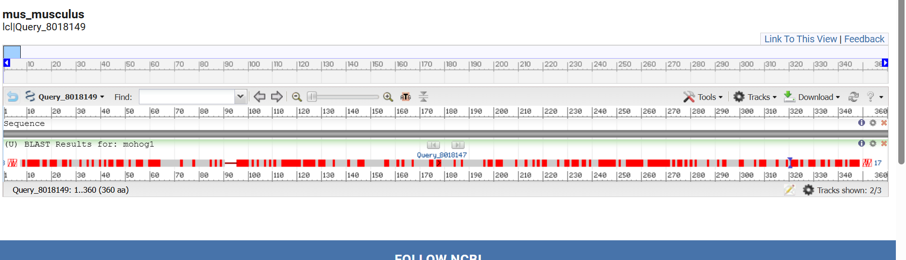

## Protein 3

Sequence:
>sp|Q9UV51|HOG1_PYRO7 Mitogen-activated protein kinase HOG1 OS=Pyricularia oryzae (strain 70-15 / ATCC MYA-4617 / FGSC 8958) OX=242507 GN=HOG1 PE=1 SV=1
MAEFVRAQIFGTTFEITSRYSDLQPVGMGAFGLVCSARDQLTNQNVAIKKIMKPFSTPVLAKRTYRELKLLKHLKHENVISLSDIFISPLEDIYFVTELLGTDLHRLLTSRPLEKQFIQYFLYQIMRGLKYVHSAGVVHRDLKPSNILVNENCDLKICDFGLARIQDPQMTGYVSTRYYRAPEIMLTWQKYDVEVDIWSAGCIFAEMLEGKPLFPGKDHVNQFSIITELLGTPPDDVINTIASENTLRFVKSLPKRERQPLKNKFKNADPSAIDLLERMLVFDPKKRITATEALAHEYLTPYHDPTDEPIAEEKFDWSFNDADLPVDTWKIMMYSEILDYHNAEAGMQQMDDQFTGQ

Selected models:

### Deep Learning (AlphaFold3)

https://alphafoldserver.com/ - AF3

#### Justification of the method

We also employed AlphaFold3, which we had used previously, to model this protein. Our first strategy involved generating the initial structure with AF3, which performs exceptionally well in modeling the kinase domain, followed by refinement using the RosettaRelax server.

#### Methods

The sequence was entered (`copies: 6`) to represent the hexameric assembly. 

### I-Tasser

@@@@@@@carlota, es esta pagina?
https://aideepmed.com/I-TASSER/

#### Justification of the method

I-TASSER is a less commonly used algorithm. This method uses a fragment assembly approach guided by threading techniques, which allows it to predict protein structures even when close homologs are limited. Although it is considerably slower than AlphaFold, it is highly robust for proteins with catalytic functions, such as kinases, due to its careful modeling of active sites and functional domains. 
Moreover, C-I-TASSER provides confidence scores and structural templates that help validate the predicted models, making it particularly suitable for challenging targets where accuracy in functional regions is critical.

#### Methods

@@@@@@@@@@carlota esto te lo dijo gemini pero, es lo que tuviste que poner en la web??? yo pondría lo de la web

The sequence was submitted and I-TASSER used multiple threading programs to identify templates from PDB. To detect templates default parameters were applied (`maximum of templates per threading program: 10`, `E-value cutoff: 1e-5`).
Structural fragments from the selected templates were assembled into full-length models. The simulations were run with 10 independent trajectories to ensure convergence, using a Monte Carlo-based fragment assembly protocol.
The generated models were further refined using the C-I-TASSER built-in refinement protocol.
Model selection and validation: The top-ranked models were selected based on the C-score, a confidence score provided by C-I-TASSER, and analyzed for structural consistency with known kinase domains.

#### Results

**Link de la solucion de I-tasser**: https://aideepmed.com/I-TASSER/output/S822579/

#### Interpretation of results (discusion)

### Modeller

Lo ultimo que me dice es usar Modeller. Se puede instalar o usar onlinen
Lo unico que tenemos que buscar nosotras los homólogos en PDB. bien porque seguro que la proteina está estudiada en otros organismos 

para ello vamos a buscar 5 templates que tengan la mejor calidad, el mejor alineamiento haciendo dos rondas de iteracion de psi-bast (run PSI-Blast iteration 2). Todo el rato hace blast 50% de Identidad con QCoverage de 9*%. 

Vamos a buscar 5 templates para que no haya sesgos por el uso de un único template ni mucho ruido por un alto numero de templates (más dificil de encontrar mñas templates igual de buenos que aporten más de lo que ensucian). Vamos a hacer un **modelado multitemplate**

#### Templates para Modeller (están las instrucciones en **InstruccionesChimera.txt**)

El modelo que ya hay con SWISS-MODEL usa https://www.rcsb.org/structure/3P5K como template, si sehace blastP de MoHog1 contra esta proteina, 380 bits(977)	2e-136	Compositional matrix adjust.	175/342(51%)	239/342(69%)	6/342(1%)

Mejor usar 3P5K porque tiene mejor resolucoin que 3p4k (ambas tienen mutaciones de labo asique como esta tiene mejo resolucion, usamos esta)

Proteinsa con más del 30% (y de 40%) de identidad con estructura resuelta de manera experimental:

https://www.rcsb.org/structure/3P5K

https://www.rcsb.org/structure/3K3I

https://www.rcsb.org/structure/8H59

https://www.rcsb.org/structure/7W5C

https://www.rcsb.org/structure/6RFP

https://www.rcsb.org/structure/2B9F 

La otra opcion si esto os da pereza es usar OmegaFold (utiliza PLMs), es menor preciso encuanto a cofactores y cosas con las que interactue la proteina y además no se pueden elegir los moldes, pero viendo los problemas de modeller, creo que va a ser lo más sencillo. es un notebook igual que alphafold y ESMfold. 