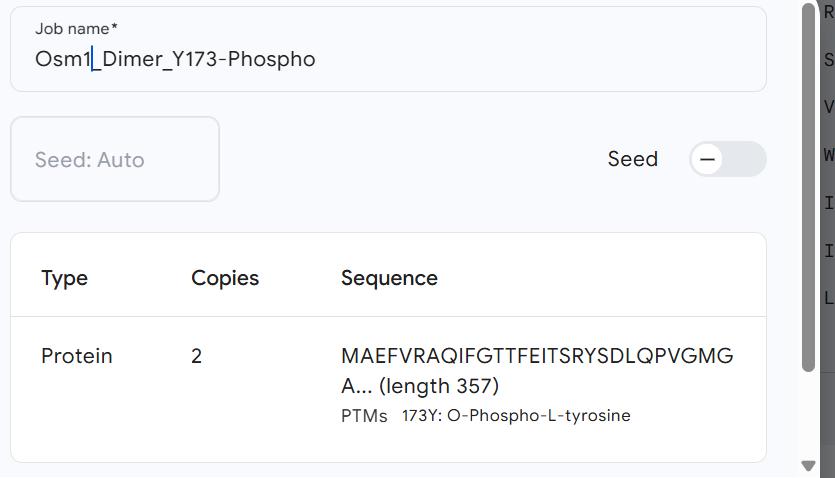

## Protein 3

Sequence to model:
>sp|Q9UV51|HOG1_PYRO7 Mitogen-activated protein kinase HOG1 OS=Pyricularia oryzae (strain 70-15 / ATCC MYA-4617 / FGSC 8958) OX=242507 GN=HOG1 PE=1 SV=1
MAEFVRAQIFGTTFEITSRYSDLQPVGMGAFGLVCSARDQLTNQNVAIKKIMKPFSTPVLAKRTYRELKLLKHLKHENVISLSDIFISPLEDIYFVTELLGTDLHRLLTSRPLEKQFIQYFLYQIMRGLKYVHSAGVVHRDLKPSNILVNENCDLKICDFGLARIQDPQMTGYVSTRYYRAPEIMLTWQKYDVEVDIWSAGCIFAEMLEGKPLFPGKDHVNQFSIITELLGTPPDDVINTIASENTLRFVKSLPKRERQPLKNKFKNADPSAIDLLERMLVFDPKKRITATEALAHEYLTPYHDPTDEPIAEEKFDWSFNDADLPVDTWKIMMYSEILDYHNAEAGMQQMDDQFTGQ

Previous analysis:
ProtSA
Solvent radius ($\text{\AA}$)Parámetro: 1.4Por qué: Es el radio estándar de una molécula de agua. Se utiliza para simular una esfera que "rueda" sobre la superficie de la proteína; el área que esta esfera puede tocar es el Área de Superficie Accesible (SASA). Si usaras un valor distinto, tus resultados no serían comparables con el umbral del 16% de PROFacc.

Unfolded conformations to generate
Parámetro: 2000

Por qué: ProtSA calcula la accesibilidad relativa comparando tu modelo (estado plegado) con un estado teóricamente desplegado. Para que ese estado desplegado sea estadísticamente fiable, necesita generar miles de conformaciones al azar (Monte Carlo). 2000 es el número sugerido para que el cálculo sea robusto sin que el servidor tarde horas.

Selected models:

To capture the dual nature of MoHog1—which alternates between a monomeric inactive state and a dimeric active state regulated by Y173 phosphorylation—a multi-platform approach was employed. AlphaFold 3 was selected for its superior accuracy in predicting the activation loop's local environment, while Modeller allowed for template-driven constraints to explore the monomeric interface based on experimental homologs.

 I-TASSER was selected due to its hybrid methodology, which combines threading and ab initio modeling. While MoHog1/MoOsm1 has several homologs that have been experimentally resolved, the sequence identities generally hover around 40%. Although this level of identity is acceptable for generating reliable models via classical homology modeling, we decided to employ a threading-based approach to gain an independent structural perspective. By integrating fragment-based ab initio folding, I-TASSER can better resolve regions where evolutionary divergence might lead to local structural variations that traditional homology modeling might overlook. Furthermore, I-TASSER was also employed to determine solvent accessibility (ASA), providing a comparative baseline against ProtSA and NetSurfP-3.0 results. Furthermore, as I-TASSER reports the specific Multiple Sequence Alignment (MSA) used during the threading process, it allows for a detailed verification of whether the main residues (TGY motif) are conserved across the selected templates, ensuring the structural integrity of the functional domains in the final model. 

### Deep Learning (AlphaFold3)

Although the structural analysis could have been performed using AlphaFold 2 by employing phosphomimetic mutations—such as the Y173D substitution used in in vivo experiments to demonstrate the impact of phosphorylation—this approach has inherent limitations. While aspartic acid partially mimics the negative charge of a phosphorylated tyrosine, it remains a surrogate that does not fully capture the specific steric and chemical properties of a true phosphate group. Consequently, AlphaFold 3 was selected for this study, as it has been specifically trained on datasets containing Post-Translational Modifications (PTMs). This allows for a more biophysically accurate representation of the monomeric state of MoOsm1, providing deeper insights into the precise structural hindrances and conformational changes triggered by actual phosphorylation at the Y173 position.

Consequently, we opted to model both the monomeric and dimeric states in their phosphorylated and unphosphorylated forms. In a biological context, MoOsm1/MoHog1 naturally exists as a phosphorylated monomer (inactive/signaling state) or an unphosphorylated dimer (active state). The phosphorylated dimer model was specifically generated to analyze the steric hindrance caused by the phosphate group, which prevents stable dimerization in vivo. Conversely, the unphosphorylated monomer was modeled to establish the baseline localization of the TGY motif in its basal state.

When analyzing these models, two key structural requirements must be met. First, in the phosphorylated monomer, the activation site must be solvent-accessible to allow for its upstream kinase to perform the phosphorylation. In addition, in the unphosphorylated dimer, the TGY motif is expected to be located within the buried interface of the complex, specifically at the protein-protein interaction site. This configuration would explain why phosphorylation at this position prevents dimerization, as the addition of a bulky, negatively charged phosphate group would physically and energetically disrupt the assembly of the dimeric interface."

https://alphafoldserver.com/ - AF3

{#fig-params-Osm1-AF3dimer}

#### Justification of the method

We also employed AlphaFold3, which we had used previously, to model this protein. Our first strategy involved generating the initial structure with AF3, which performs exceptionally well in modeling the kinase domain, followed by refinement using the RosettaRelax server.

#### Methods

The sequence was entered (`copies: 6`) to represent the hexameric assembly. 

### I-Tasser

#### Justification of the method

I-TASSER is a less commonly used algorithm. This method uses a fragment assembly approach guided by threading techniques, which allows it to predict protein structures even when close homologs are limited. Although it is considerably slower than AlphaFold, it is highly robust for proteins with catalytic functions, such as kinases, due to its careful modeling of active sites and functional domains. 
Moreover, C-I-TASSER provides confidence scores and structural templates that help validate the predicted models, making it particularly suitable for challenging targets where accuracy in functional regions is critical.

BBL del I-tasser.
web: https://aideepmed.com/I-TASSER/
Please cite the following articles when you use the I-TASSER server:
- Wei Zheng, Chengxin Zhang, Yang Li, Robin Pearce, Eric W. Bell, Yang Zhang. Folding non-homology proteins by coupling deep-learning contact maps with I-TASSER assembly simulations. Cell Reports Methods, 1: 100014 (2021).
- Chengxin Zhang, Peter L. Freddolino, and Yang Zhang. COFACTOR: improved protein function prediction by combining structure, sequence and protein-protein interaction information. Nucleic Acids Research, 45: W291-299 (2017).
- Jianyi Yang, Yang Zhang. I-TASSER server: new development for protein structure and function predictions, Nucleic Acids Research, 43: W174-W181, 2015.

#### Methods

@@@@@@@@@@carlota esto te lo dijo gemini pero, es lo que tuviste que poner en la web??? yo pondría lo de la web

The sequence was submitted and I-TASSER used multiple threading programs to identify templates from PDB. To detect templates default parameters were applied (`maximum of templates per threading program: 10`, `E-value cutoff: 1e-5`).
Structural fragments from the selected templates were assembled into full-length models. The simulations were run with 10 independent trajectories to ensure convergence, using a Monte Carlo-based fragment assembly protocol.
The generated models were further refined using the C-I-TASSER built-in refinement protocol.
Model selection and validation: The top-ranked models were selected based on the C-score, a confidence score provided by C-I-TASSER, and analyzed for structural consistency with known kinase domains.

#### Results

**Link de la solucion de I-tasser**: https://aideepmed.com/I-TASSER/output/S822579/

#### Interpretation of results (discusion)

### Modeller

Lo ultimo que me dice es usar Modeller. Se puede instalar o usar onlinen
Lo unico que tenemos que buscar nosotras los homólogos en PDB. bien porque seguro que la proteina está estudiada en otros organismos 

para ello vamos a buscar 5 templates que tengan la mejor calidad, el mejor alineamiento haciendo dos rondas de iteracion de psi-bast (run PSI-Blast iteration 2). Todo el rato hace blast 50% de Identidad con QCoverage de 9*%. 

Vamos a buscar 5 templates para que no haya sesgos por el uso de un único template ni mucho ruido por un alto numero de templates (más dificil de encontrar mñas templates igual de buenos que aporten más de lo que ensucian). Vamos a hacer un **modelado multitemplate**

#### Templates para Modeller (están las instrucciones en **InstruccionesChimera.txt**)

El modelo que ya hay con SWISS-MODEL usa https://www.rcsb.org/structure/3P5K como template, si sehace blastP de MoHog1 contra esta proteina, 380 bits(977)	2e-136	Compositional matrix adjust.	175/342(51%)	239/342(69%)	6/342(1%)

Mejor usar 3P5K porque tiene mejor resolucoin que 3p4k (ambas tienen mutaciones de labo asique como esta tiene mejo resolucion, usamos esta)

Proteinsa con más del 30% (y de 40%) de identidad con estructura resuelta de manera experimental:

https://www.rcsb.org/structure/3P5K

https://www.rcsb.org/structure/3K3I

https://www.rcsb.org/structure/8H59

https://www.rcsb.org/structure/7W5C

https://www.rcsb.org/structure/6RFP

https://www.rcsb.org/structure/2B9F 

La otra opcion si esto os da pereza es usar OmegaFold (utiliza PLMs), es menor preciso encuanto a cofactores y cosas con las que interactue la proteina y además no se pueden elegir los moldes, pero viendo los problemas de modeller, creo que va a ser lo más sencillo. es un notebook igual que alphafold y ESMfold. 

@@@martaA:
Para poder hacer el modeller (y escribirlo en métodos) exactamente he seguido las intsrucciones de carlota del .txt, y luego he seleccionado como template todas las estructuras.
Correr en web y contraseña: MODELIRANJE
he hecho el modeller y me da cinco modelos (captura:)

 

(esa foto es pa quitarla pero bueno para q la veas carlota)

me dice gemini que hay que seleccionar por el zDOPE (que es la unica metrica que tenemos realmente)
a zDOPE más negativo mejor modelo (más estable es la estructura físicamente)

 Busca el valor más negativo (por ejemplo, -1.2 es mejor que -0.8). Cuanto más bajo sea, más estable es la estructura físicamente.
 asi q selecciono el 6.4 (-1.45 de zDOPE)

*OJO, aun así ya he aprendido a hacerlo y solo le he pedido 5 modelos, se podrían pedir más si eso (se tarda aprox 20 mins desde q empiezas a abrir chimerax y meter todas las cosas)

he dejado el modelo guardado en:
(../models/hog1_modeller/finalmodel/structure_modeller.pdb)