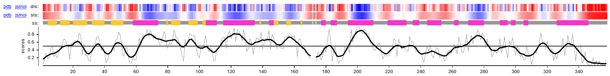
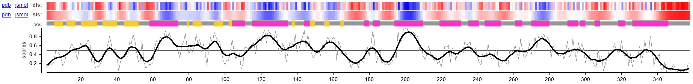
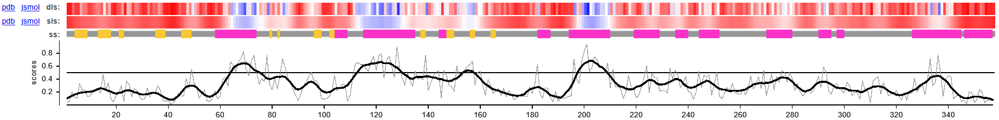

### Cross-method evaluation of Protein 3 models

#### **Methods**

Consistent with the previous proteins, a standardized cross-method evaluation protocol was implemented to establish a robust and unbiased comparison across the different predictive algorithms.

#### **Final model selection**

To establish a definitive comparison across the three predictive methodologies (AlphaFold3, I-TASSER, and Modeller), all generated .pdb files for the monomeric state were submitted to the SWISS-MODEL Structure Assessment tool to extract their universal QMEANDisCo Global scores. The evaluation yielded highly consistent scores for AlphaFold3 (0.77) and Modeller (0.75), indicating excellent, native-like stereochemical quality and geometric packing. In contrast, I-TASSER achieved a significantly lower score of 0.46. This penalty is a common artifact of its hybrid ab initio fragment assembly approach, which often introduces slight geometric strains or suboptimal packing in flexible loop regions compared to pure homology or advanced deep learning models.

The pairwise structural alignments performed in PyMOL strongly support these quality metrics. The most remarkable consensus was observed between the deep learning model (AlphaFold3 dual-phosphorylated monomer) and the classical homology model (Modeller), yielding an exceptionally low RMSD of 1.06 Å across their conserved cores. This near-perfect superposition confirms that the AlphaFold3 prediction strictly respects the canonical kinase architecture defined by experimental templates. Conversely, when comparing I-TASSER against the other models, the structural deviation increased slightly: AF3 vs. I-TASSER yielded an RMSD of 1.74 Å, and Modeller vs. I-TASSER resulted in 1.84 Å. While an RMSD under 2.0 Å still confirms that all three algorithms correctly folded the global kinase domain, the slight divergence of I-TASSER further highlights its ab initio nature, which allowed more conformational freedom in the less conserved regions.

Based on this comprehensive evaluation, AlphaFold3 emerges as the superior model. Not only does it boast the highest global stereochemical quality (QMEANDisCo 0.77) and a near-perfect structural consensus with classical homology modeling (RMSD 1.06 Å), but it also provides a critical biological advantage: the ability to accurately incorporate and evaluate Post-Translational Modifications. Unlike Modeller, which failed to natively resolve the flexible TXY activation loop due to missing template coordinates, AF3 successfully modeled the dual-phosphorylated state (pT171/pY173) without algorithmic bias, allowing for a precise biophysical analysis of the active kinase. Therefore, the AlphaFold3 dual-phosphorylated monomer is selected as the definitive structural model for MoOsm1/MoHog1.

Finally, the results of the VoroMQA evaluation are summarized in the @tbl-model-comparison-Hog1.

| Model | Global score | 
| AlphaFold 3 | 0.536 |
| Modeller | 0.515 | 
| I-TASSER | 0.329 |

: Comparison of the structural quality and interface scores obtained for the models generated with AlphaFold3, Modeller and I-TASSER for Osm1 (MoHog1). {#tbl-model-comparison-Osm1}

All models correspond to the monomeric state of the protein. 
The model generated by AlphaFold 3 achieved the highest global score, as it is shown in the @tbl-model-comparison-Osm1, closely followed by the Modeller model, whereas the I-TASSER model obtained a noticeably lower score.

The higher global score obtained by AlphaFold3 reflects a more optimal atomic packing across the structure. The Modeller model also shows good quality, and its slightly lower score could be explained by the limitations in modeling flexible regions or areas with limited template information. In contrast, the lower score of the I-TASSER structure suggests inconsistences in atomic packing and reduced reliability while modelling flexible regions, consistent with its hybrid approach, which relies on *ab initio* predictions in these kind of segments. 

In addition, the Local Score profiles (upper panels in @fig-voromqa-panels-Osm1) are very similar between the AlphaFold3 and the Modeller models. Both display nearly identical profile traces, with the highest-confidence regions ocurring in the same positions. In contrast, the I-TASSER model shows a mor irregular and overall lower profile with a larger number of lower-confidence regions.

::: {#fig-voromqa-panels-Osm1 layout-ncol=1}

{#a}

{#b}

{#c}

VoroMQA structural quality assessment for the three predicted models (AlphaFold3, Modeller and I-TASSER)
:::

These results support the previous evaluations based on QMEANDisCo and RMSD, confirming that AlphaFold 3 provides the most reliable structural model of the protein.