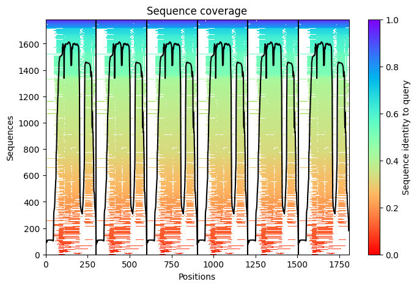
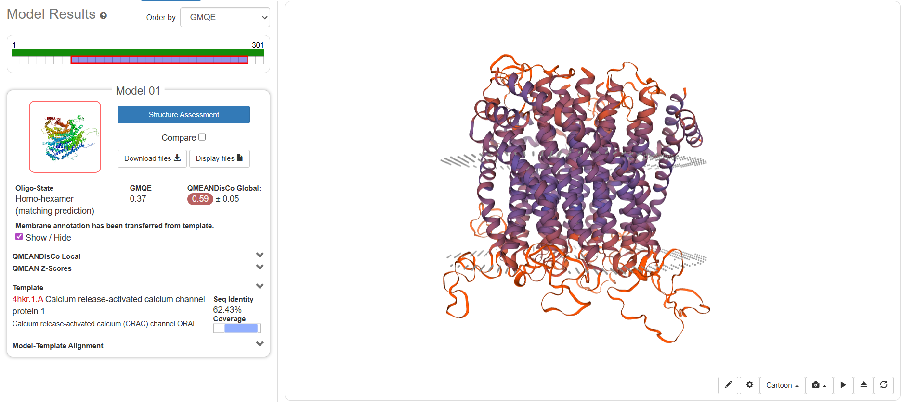

# Model selection

## Protein 1 - ORAI1

Sequence to model:
>sp|Q96D31|ORAI1_HUMAN Calcium release-activated calcium channel protein 1 OS=Homo sapiens OX=9606 GN=ORAI1 PE=1 SV=2
MHPEPAPPPSRSSPELPPSGGSTTSGSRRSRRRSGDGEPPGAPPPPPSAVTYPDWIGQSYSEVMSLNEHSMQALSWRKLYLSRAKLKASSRTSALLSGFAMVAMVEVQLDADHDYPPGLLIAFSACTTVLVAVHLFALMISTCILPNIEAVSNVHNLNSVKESPHERMHRHIELAWAFSTVIGTLLFLAEVVLLCWVKFLPLKKQPGQPRPTSKPPASGAAANVSTSGITPGQAAAIASTTIMVPFGLIFIVFAVHFYRSLVSHKTDRQFQELNELAEFARLQDQLDHRGDHPLTPGSHYA

Selected models:

### Deep Learning (AlphaFold2-Multimer) 

Estoy probando con: https://alphafoldserver.com/ 

https://colab.research.google.com/github/sokrypton/ColabFold/blob/main/AlphaFold2.ipynb#scrollTo=ADDuaolKmjGW

#### Justification of the method

To model the oligomeric structure of ORAI1, we used **AlphaFold2 Multimer** implemented through *ColabFold*. 
AlphaFold2 Multimer is specifically designed to predict protein–protein interactions and multimeric assemblies, making it suitable for modeling the hexameric arrangement of ORAI1 subunits. 
ColabFold provides an efficient and accessible implementation of AlphaFold2 Multimer with optimized multiple sequence alignment generation and accelerated inference, allowing reliable prediction of protein complexes with reduced computational cost. 
Therefore, this approach enables the structural modeling of the ORAI1 hexamer and the analysis of the interactions that stabilize the channel pore.
However, the resulting model represents a **static structural snapshot** of the predicted complex rather than the full conformational dynamics of the channel.

#### Methods

**MA: igual esto sobra un poco y es too much, pero como dijo lo de la reproducibilidad he puesto todos los parámetros que he usado**
Since ORAI1 forms a hexameric channel, the sequence corresponding to the alpha isoform was entered six times, separated by “:”.
The parameter num_relax = 1 to only get one structural relaxation, helping to correct geometric strains in the predicted structure.
With template_mode: pdb100, structural templates from the Protein Data Bank were allowed so that AlphaFold could use homologous proteins during modeling.
For evolutionary information, msa_mode: mmseqs2_uniref_env was used, which is the standard method to generate MSA.
The parameter pair_mode: unpaired_paired was selected because it performs well for homooligomeric complexes.
The option model_type: alphafold2_multimer_v3 was used because it is specifically designed to predict protein complexes and inter-chain interactions.
The number of internal refinement cycles was set to num_recycles = 3, as higher values significantly increase computation time.
The parameter recycle_early_stop_tolerance = 0.5 allows the refinement process to stop early when structural improvements become minimal.
For the final relaxation step, relax_max_iterations = 200 was used to improve geometry without unnecessarily increasing computational cost.
The pairing_strategy: greedy option was used to efficiently pair sequences during the alignment process.
In the sampling settings, max_msa: auto allows the system to automatically determine the optimal MSA size.
Finally, num_seeds = 1 was used since a single model is usually sufficient for an initial prediction, and use_dropout was kept disabled to obtain a more stable prediction.

#### Results

First, a Sequence Coverage Plot is obtained, which helps evaluate the expected reliability of the model. 

The black line represents the number of sequences aligned at each position. It shows that the transmembrane domains of ORAI1 are highly conserved, while the N-terminal and C-terminal regions display lower coverage, consistent with their flexibility.

The color scale indicates sequence similarity: blue corresponds to highly similar sequences, whereas red indicates lower sequence identity.

Overall, the plot shows deep coverage in the protein core, meaning that AlphaFold2 Multimer has sufficient evolutionary information to accurately predict the folding of the helices and the channel interfaces. Consequently, the resulting model is expected to be reliable, with high predicted confidence (pLDDT) in the central region of the protein and lower confidence at the termini, consistent with the drop in sequence coverage.

@@@@@no me genera más resultados OK

### SWISS-MODEL (Homology based)

https://swissmodel.expasy.org/interactive

#### Justification of the method

SWISS-MODEL was chosen as a second modeling approach to apply a classical homology-based methodology using high-resolution experimental templates. This platform allows the prediction to be anchored on known structures of orthologous proteins, which is essential to validate the overall architecture of the channel and the geometry of the pore. 
Additionally, SWISS-MODEL provides automated template selection, quality assessment scores, and model refinement, ensuring reliable and interpretable models. 
Also, this approach is considered the gold standard when high-resolution experimental templates (Cryo-EM or X-ray crystallography) are available (like for ORAI1).

#### Methods

For SWISS-MODEL, only the protein sequence was submitted once, since the server automatically handles oligomeric assemblies through the selected templates. In the “Search for Templates” step, we looked for high-resolution experimental structures to serve as references for homology modeling.

Once the results appeared, we focused on templates with the highest sequence identity and selected the hexameric oligomeric state to model the complete channel. Among the available templates, the top hit was Q96D31.1.A, which corresponds to an existing AlphaFold model. We did not use this entry because it represents a monomer rather than the full hexameric channel.

Instead, we chose a true experimental template obtained by X-ray crystallography. We selected 4HKS.1.B, which has a resolution of 3.4 Å, is a homo-hexamer, and includes calcium ions, making it ideal for comparison with the AlphaFold model to assess whether the channel pore and ion-binding sites are correctly preserved.
Template used to build models:
>>4hks.1.B Calcium release-activated calcium channel protein 1
>>Calcium release-activated calcium (CRAC) channel ORAI, K163W mutant

#### Results

The homology model generated using SWISS-MODEL was based on the crystal structure of the Orai protein from Drosophila melanogaster (PDB ID: 4HKS), which shares 62.43% sequence identity with the human protein. 

@@@@revisar contenido de esta tabla no sé si está bien!!!!

| Parameter             | Value        | Technical Interpretation                                                                      |
|-----------------------|-------------|------------------------------------------------------------------------------------------------|
| **Template**          | 4HKS.1.B     | X-ray crystallography structure of Drosophila (wild-type).                                    |
| **Oligomeric State**  | Homo-hexamer | Matches the biologically functional assembly of the channel.                                  |
| **Sequence Identity** | 62.43%       | High; ensures reliable folding of the transmembrane core.                                     |
| **GMQE**              | 0.37         | Low, due to incomplete coverage of the flexible N- and C-terminal regions.                    |
| **QMEANDisCo Global** | 0.59 ± 0.05  | Moderate-to-good quality for a membrane protein with intrinsically disordered regions (IDRs). |

Although the GMQE (0.37) and QMEANDisCo (0.59) scores may appear moderate, they accurately reflect the structural characteristics of human Orai1. The selected template (4HKS.1.A) primarily covers the transmembrane domains, leaving out the N- and C-terminal regions, which are intrinsically disordered in humans. The high sequence identity in the channel core (62.43%) ensures that the pore architecture is accurately modeled, while the lower global scores are a common artifact in membrane proteins with long cytoplasmic segments lacking defined secondary structure.

### RosettaMP

ORAI1 is a membrane protein, and is is rounded by lipids, so changes drastically its conformation.
RosettaMP its specifically design for energit limitations of lipid bilayer and ables to explore the protein flexibility
It is the perfect option to understand the different states: open vs. close; and calculates the neccesary energy that enables the movement of the helix and enables the calcium crossing.

## Protein 2
https://swissmodel.expasy.org/interactive/EPauqp/models/ #Es solo para tenerlo a mano (Son los modelos generados por homología - Swiss model)

### Initial de novo modeling using AlphaFold2 (Monomer)
For the initial prediction of Sequence 2, the AlphaFold2 Deep Learning protocol was employed via the ColabFold environment. To maintain reproducibility and consistency with the rest of the project (see the modeling of the ORAI1 channel), the same general execution parameters were kept (num_relax = 1, template_mode: pdb100, msa_mode: mmseqs2_uniref_env, relax_max_iterations = 200, max_msa: auto, num_seeds = 1, use_dropout = false).

However, since no information regarding the quaternary structure was available at this initial stage and the protein was assumed to act individually, the following strategic modifications were applied:

- Sequence input: The sequence was entered only once.

- model_type: The multimer version was replaced by alphafold2_ptm. This option is optimized for the folding of single chains (monomers) and allows for the accurate calculation of the Predicted Aligned Error (PAE) for individual domains.

- num_recycles: This parameter was increased from 3 to 6. The rationale for this increase lies in the results of our prior 1D topological analysis. Having detected an intrinsically disordered region (IDR) acting as a linker (residues 60-85) following the signal peptide, more refinement cycles were granted to the neural network to facilitate the structural convergence of these highly flexible zones. Being a single chain, this increase did not compromise computational feasibility.

### Homology Modeling and the Discovery of Quaternary Structure (SWISS-MODEL)
In parallel with the de novo modeling, homology modeling was performed using the SWISS-MODEL server. Rather than automating the process, a manual template search (Search for Templates) was conducted to evaluate the availability of evolutionarily related crystallographic structures.

During the analysis of the templates returned by the database (PDB), a crucial biological discovery was made: all the top-scoring templates exhibited a homo-trimeric oligomeric state. This marked a turning point in our methodological approach, allowing us to deduce that the functional enzyme in nature is not a monomer, but a complex formed by three identical assembled subunits.

To build the models, three strategic templates were manually selected based on their balance of coverage, even though they fell into the "Twilight Zone" of sequence identity (~17-22%):

- 6tgf.1.A: Due to its high coverage and its annotation as a phage tail protein, supporting our evolutionary hypothesis.

- 8iq9.1.A: Because it crystallized alongside oligosaccharide ligands, the expected substrate for a pectate lyase.

- 6eu4.1.A: For including a coordinated Zinc ion, providing information about potential metallic cofactors.

Final Homology Model Selection:
Following the generation of the structures, we opted for Model 1 (based on the 6tgf.1.A template). The justification for this choice is twofold: first, it conserved the discovered homo-trimer architecture; and second, it obtained the best evaluation metrics from the server, with a GMQE of 0.28 and a universal QMEANDisCo Global score of 0.47.

It is crucial to highlight that this QMEANDisCo value, considered low-to-moderate, does not reflect a procedural error, but rather the inherent limitations of homology modeling when lacking high sequence identity templates (all below 25%). This result fully justifies our decision to integrate advanced Deep Learning methods (such as AlphaFold and RoseTTAFold/ESMFold) to resolve the structure with a higher degree of confidence.

## Protein 3

>sp|Q9UV51|HOG1_PYRO7 Mitogen-activated protein kinase HOG1 OS=Pyricularia oryzae (strain 70-15 / ATCC MYA-4617 / FGSC 8958) OX=242507 GN=HOG1 PE=1 SV=1
MAEFVRAQIFGTTFEITSRYSDLQPVGMGAFGLVCSARDQLTNQNVAIKKIMKPFSTPVLAKRTYRELKLLKHLKHENVISLSDIFISPLEDIYFVTELLGTDLHRLLTSRPLEKQFIQYFLYQIMRGLKYVHSAGVVHRDLKPSNILVNENCDLKICDFGLARIQDPQMTGYVSTRYYRAPEIMLTWQKYDVEVDIWSAGCIFAEMLEGKPLFPGKDHVNQFSIITELLGTPPDDVINTIASENTLRFVKSLPKRERQPLKNKFKNADPSAIDLLERMLVFDPKKRITATEALAHEYLTPYHDPTDEPIAEEKFDWSFNDADLPVDTWKIMMYSEILDYHNAEAGMQQMDDQFTGQ

### AlphaFold3

Primera estrategia:
Generación del modelo: Usa AlphaFold 3 para obtener la estructura inicial (es excepcional modelando el dominio de quinasa).

Refinamiento: Pasa ese modelo por el servidor RosettaRelax.

### I-Tasser

Análisis: Utiliza un software llamado C-I-TASSER. Es un algoritmo "menos común" que el AlphaFold estándar; utiliza una técnica de ensamblaje de fragmentos mediante enhebrado (threading). Es famoso por ser mucho más lento pero muy robusto para proteínas que tienen funciones catalíticas como las quinasas.

Lo he mandado a hacer a I-TASSER, todo por defecto porque gema dice que:
Gemini ha dicho
Here is the description of the parameters and their justifications in text format, ready for your report or to guide your submission:

I-TASSER Configuration and Justifications
Amino Acid Sequence: The complete primary sequence of the MoHog1 protein (352 residues) was provided. This sequence serves as the foundation for the threading process and the subsequent fragment assembly.

Exclude Homologous Templates (Option II): This parameter was kept at its default setting (None). By not excluding any homologous templates, we allowed the server to access all available structures in the Protein Data Bank (PDB). For a protein kinase like Hog1, utilizing high-identity templates (such as the well-characterized yeast Hog1 or human p38 orthologs) is crucial to achieving a high-resolution model with a biologically relevant fold.

Specify Secondary Structure (Option III): No manual secondary structure constraints were uploaded, leaving this to the default automated prediction. The server utilizes PSSpred, a highly robust tool that generates secondary structure profiles from multiple sequence alignments. Letting the algorithm handle this ensures that the predicted alpha-helices and beta-strands are consistent with the latest evolutionary data.

Assign Restraints (Option IV): The choice was made to leave this section blank (Default). Avoiding manual spatial restraints ensures that the Monte Carlo simulations can explore the protein’s energy landscape without bias. This is the best approach for MoHog1, as it allows the algorithm to find the most thermodynamically stable conformation for the catalytic domain and the flexible loops.

Assign Templates (Option V): The automated LOMETS threading meta-server was used by default to select structural templates. This ensures that the program selects the most appropriate and high-quality kinase structures from the PDB based on sequence-structure alignments, rather than being forced to use a specific, potentially less-optimal template chosen by the user.

### Modeller
Lo ultimo que me dice es usar Modeller. Se puede instalar o usar onlinen
Lo unico que tenemos que buscar nosotras los homólogos en PDB. bien porque seguro que la proteina está estudiada en otros organismos 